+++
date = '2026-05-27T11:54:51+01:00'
draft = true
title = 'Standoff Cyberbones Heavy Logistics Task 7.1'
image = "featured.png"
tags = ["Active Directory", "MaxPatrol SIEM", "Blue Team", "cyberrange", "digital twin", "Kerberos"]
summary = """
Standoff Cyberbones is a Cyberrange in which we investigate events which happened on a fictional
State called State F. This state contains a number of industries which are digital twins of real industries, like
Banking, City & Housing Utilities, Heavy Logistics..
In this exercise we investigate a phishing event against a Heavy Logistics industry, which led attackers
to discover a password file on the workstation of a user, and perform privilege escalation within the
domain.
"""
+++


# Introduction

The Standoff Cyberbones is a virtual environment which puts us in a situation of a cyber defender for a fictional state
called **State F**. State F possesses a number of critical Industries, which were attacked during the
Standoff Cyberbattle 2022. State F's industries are **digital twins** of real industries like Banking, Heavy Logistics,
City & Housing Utilities ... etc.

The Standoff Cyberbattle is an annual cyber exercise which brings together teams of white hat hackers all over the world
to attack a digital replica of the fictional state, State F, and generate security relevant events.

Logs, Artifcats and traffic dumps from the Standoff Cyberbattle are collected, effective TTPs from white hat hackers are handpicked and their kill chains reconstructed. For us defenders to investigate them in a virtual environment
using **commercial security tools**. This virtual environment is referred to as Cyberbones.


# Task Description

In this task, we are put in the context of a fictional transportation company of **State F** known as **Heavy Logistics**.

One day, an administrator setting up a computer of an HR officer left his domain account password in a file within that
computer, and shortly afterwards the company was targeted by a phishing attack.

The perpetrators of the attack gained access to the computer of the HR officer, found the file and used the password
to escalate their privileges.
The goal is to find the name of the HR officer's workstation on which the password file is stored.

- Administrator name: **Boyd Rivers**
- Administrator account: **b_rivers_admin**

Timeline of the attack: **November 23, 2022 from 09:30 to 09:50 UTC**

Security Tools: MaxPatrol SIEM


# Network Architecture

A full network diagram of the infrastructure of the Heavy Logistics company is available at [this link](https://api.standoff365.com/api/game-portal/wiki/docs/735d54a8-547f-4ec1-8641-58bd650cb62a)

The HR department is made up of 3 workstations


There are 2 domain controllers in the environment:

- `dc.hv-logistics.stf`
- `dc-2.hv-logistics.stf`

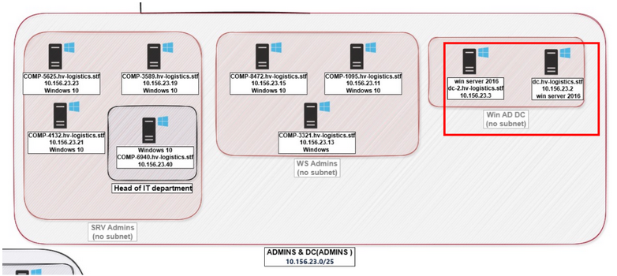


# Procedure

The first step is to narrow down the event timeline in MaxPatrol SIEM to the time range of the phishing attack
(November 23, 2022, 09:30 to 09:50 UTC)

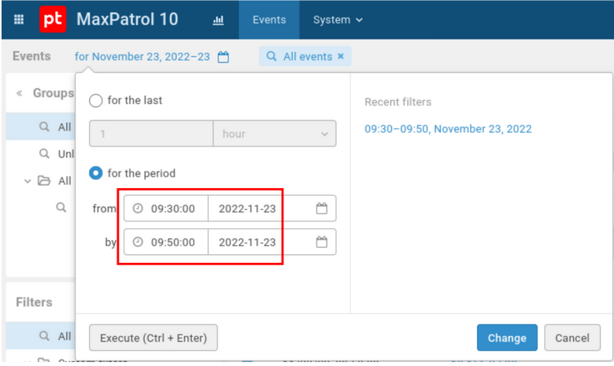

## Filtering for events involving directory services

Given that the activity of the attackers most likely involved communication with Domain Controllers, the query
below was used to filter events involving directory services in MaxPatrol SIEM.

```sql
event_src.category = "Directory service"
```

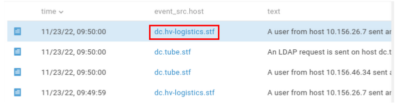

- In the image above, 12307 events matched this query
- Among these events, some bear the hostname `dc.hv-logistics.stf` which probably means Heavy Logistics.


## Filtering "Directory Service" events from HR Computers

Using the query below, only Directory service events involving the computers of the HR department were
matched. 

```sql
event_src.category = "Directory service" and in_list(["10.156.24.5", "10.156.24.2", "10.156.24.4"], src.ip)
```

- The `in_list` function takes two arguments:
    - 1st argument: A list of values we want to match
    - 2nd argument: A field in the event we are filtering
    - If events whose target field contains one of the values provided in the first argument are found, they will be returned by the function.
- The query provided no matching events

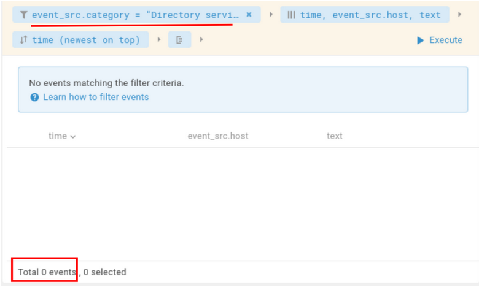

A variation of the previous query was tried, to verify that no events really matched the condition.

```sql
event_src.category = "Directory service" and (src.ip = "10.156.24.5" or src.ip = "10.156.24.2" or src.ip = "10.156.24.4")
```

- No results were still returned

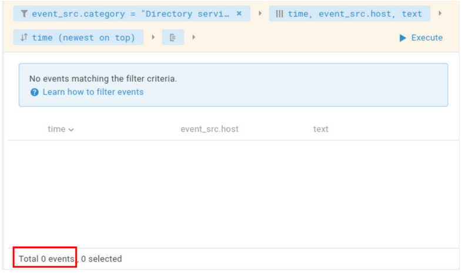

Another variation was attempted again, but this time using the `in_subnet` function

```sql
event_src.category = "Directory service" and in_subnet(src.ip, "10.156.24.0/25")
```

- The function `in_subnet` above, will match every event whose `src.ip` field is in the subnet `10.156.24.0/25`
- The query above gave some results, but the computers involved were not HR computers.
- And it was noticed from this query that both `dc.hv-logistics.stf` and `dc-2.hv-logistics.stf` are queried via LDAP.

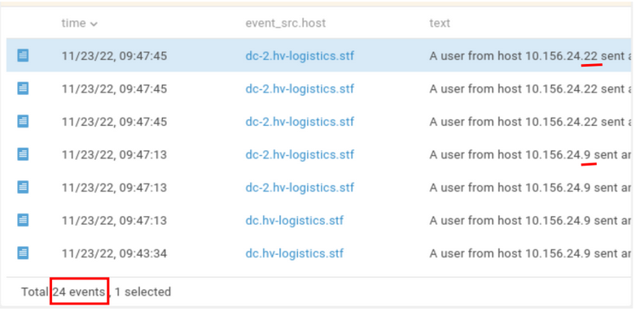

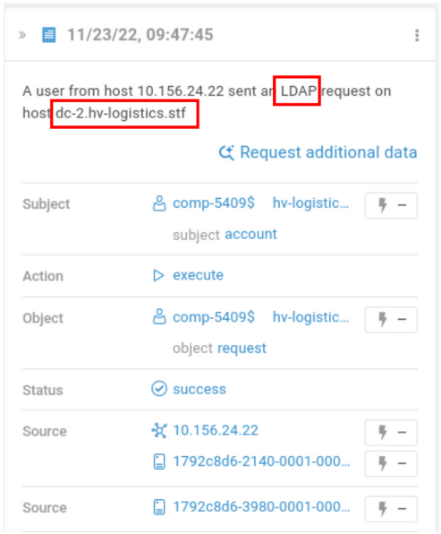

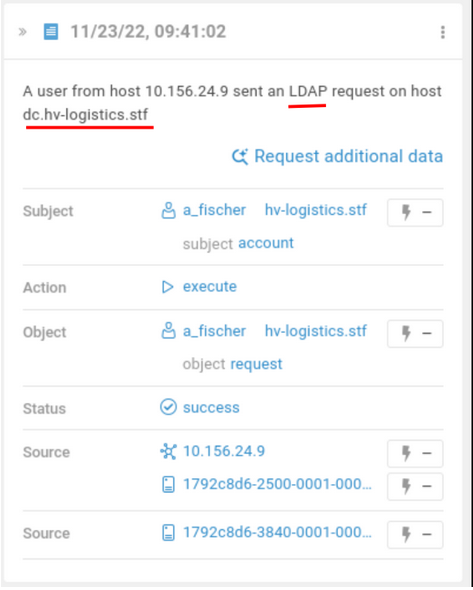


## Filtering any events where HR Computers are the source and DCs are the destinations

```sql
in_list(["10.156.24.5", "10.156.24.2", "10.156.24.4"], src.ip) and in_list(["dc.hv-logistics.stf", "dc-2.hv-logistics.stf"], dst.host)
```

- The query above gave 196 results.
- The first result (latest result) was the detection of `SharpHound` or `BloodHound` connection from host `10.156.24.4`
  by user `d_jensen`.
- There are other instances where the `d_jensen` account is used to access suspicious shares like `IPC`.


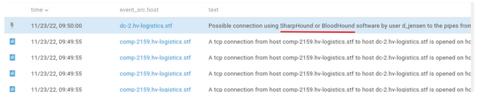

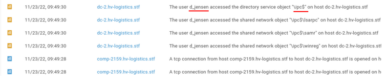

- However our focus is the `b_rivers_admin` account.


## Filtering for the `b_rivers_admin` account in events involving DC and HR Computers

The previous query was modified to filter for events in which the `b_rivers_admin` account was the subject of the
event.

```sql
in_list(["10.156.24.5", "10.156.24.2", "10.156.24.4"], src.ip) and in_list(["dc.hv-logistics.stf", "dc-2.hv-logistics.stf"], dst.host) and subject.account.name = "b_rivers_admin"
```

- From this query, a single event was matched.
- This event was a failed login attempt from "10.156.24.4" for the `b_rivers_admin` account to `dc-2.hv-logistics.stf`.
- But this isn't enough to establish the source of the attack.

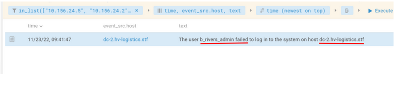

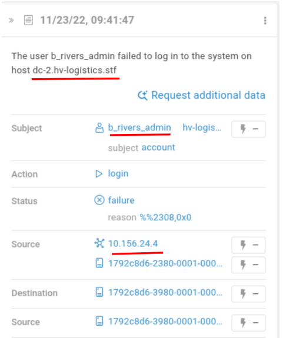


## Removing `dst.host` filter from previous query

The previous query was further refined by removing the `in_list(["dc.hv-logistics.stf", "dc-2.hv-logistics.stf"], dst.host)`
constraint which enforced that `dc.hv-logistics.stf` and `dc-2.hv-logistics.stf` be the destination hosts of the event.

```sql
in_list(["10.156.24.5", "10.156.24.2", "10.156.24.4"], src.ip) and subject.account.name = "b_rivers_admin"
```

- There were 35 events that matched the query above.
- Among them, an event which suggests a successful access to `dc-2.hv-logistics.stf` from the computer "10.156.24.4" for
  the `b_rivers_admin` account was found.
- This is supposed to be an abnormal behavior, because an Admin isn't supposed to connect to a Domain Controller (using his own account) from a user workstation.


- There were other pairs of events which involved:
    - A TGT granting by `dc-2.hv-logistics.stf` due to successful authentication as the `b_rivers_admin` user
      from the host "10.156.24.4".
    - Then subsequent issuing of a Service Ticket to "10.156.24.4" for the `b_rivers_admin` account to access the workstation
      `COMP-2159` (10.156.24.4).
    - The above suggests someone also authenticated on 10.156.24.4 as the `b_rivers_admin` user.

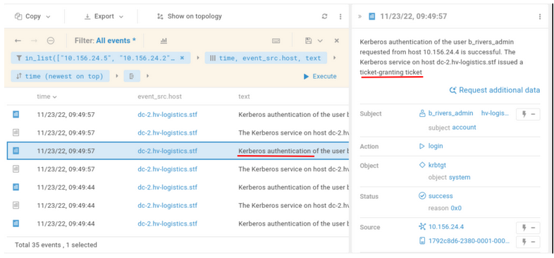


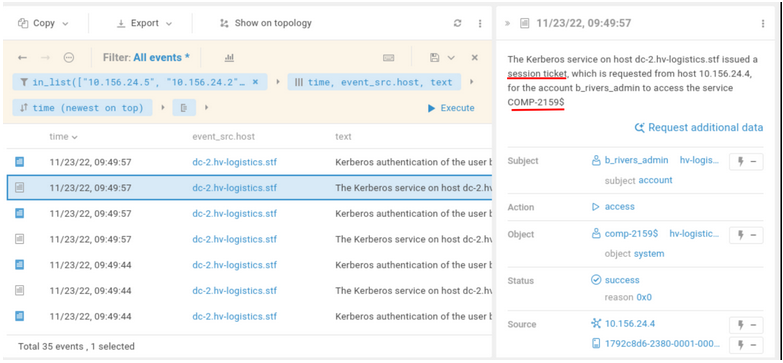

- Based on the earlier successful authentication from "10.156.24.4" to `dc-2.hv-logistics.stf` as `b_rivers_admin` (through
  issuing of a Service Ticket by the Kerberos server on `dc-2`), it was concluded that the privilege escalation was done
  from 10.156.24.4. The name of this HR officer's workstation is `COMP-2159.hv-logistics.stf` (from the full network diagram).

- It was also noticed in the updated query above, that the events of interest don't have the field `dst.host`, but
  `event_src.host` instead, with the value `dc-2.hv-logistics.stf` (suggesting that the DC was the source of the event).
  Which explains why we couldn't capture these events in the previous query which was filtering with `dst.host`.


- The points for the task were acquired by submitting the hostname `COMP-2159.hv-logistics.stf`

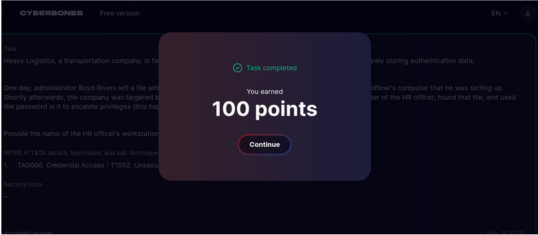


# Ref

- https://defend.standoff365.com/en-US/
- https://cyberbones.standoff365.com/en-US/
- https://help.ptsecurity.com/en-US/projects/siem/latest/help/10887370763