+++
date = '2026-06-16T13:25:18+01:00'
draft = true
title = 'Standoff Cyberbones Heavy Logistics Task 7.2'
image = "featured.png"
tags = ["Active Directory", "MaxPatrol SIEM", "PT NAD", "Blue Team", "Runascs_net2.exe", "cyberrange", "digital twin", "Kerberos"]
summary = """
Standoff Cyberbones is a Cyberrange in which we investigate events which happened on a fictional
State called State F.
In this exercise we investigate a phishing event against the Heavy Logistics industry of State F,
which led attackers to discover a password file on the workstation of a user, and perform privilege escalation within the domain. We are required to provide the password of the `b_rivers_admin` account.
"""
+++


# Introduction

The Standoff Cyberbones is a virtual environment which puts us in a situation of a cyber defender for a fictional state
called **State F**. State F possesses a number of critical Industries, which were attacked during the
Standoff Cyberbattle 2022. State F's industries are **digital twins** of real industries like Banking, Heavy Logistics, City & Housing Utilities ... etc.

The Standoff Cyberbattle is an annual cyber exercise which brings together teams of white hat hackers all over the world to attack a digital replica of the fictional state, State F, and generate security relevant events.

Logs, Artifcats and traffic dumps from the Standoff Cyberbattle are collected, effective TTPs from white hat hackers are handpicked and their kill chains reconstructed. For us defenders to investigate them in a virtual environment using **real commercial security tools**. This virtual environment is referred to as Cyberbones.


# Task Description

In this task, we are put in the context of a fictional transportation company of **State F** known as **Heavy Logistics**.

One day, an administrator setting up a computer of an HR officer left his domain account password in a file within that computer, and shortly afterwards the company was targeted by a phishing attack.

The perpetrators of the attack gained access to the computer of the HR officer, found the file and used the password
to escalate their privileges.
The goal of this second task on the Heavy Logistic Company is to provide the password of `b_rivers_admin` account.

- Administrator name: **Boyd Rivers**
- Administrator account: **b_rivers_admin**

Timeline of the attack: **November 23, 2022 from 09:30 to 09:50 UTC**

Security Tools: MaxPatrol SIEM


# Network Architecture

A full network diagram of the infrastructure of the Heavy Logistics company is available at [this link](https://api.standoff365.com/api/game-portal/wiki/docs/735d54a8-547f-4ec1-8641-58bd650cb62a)

The HR department is made up of 3 workstations

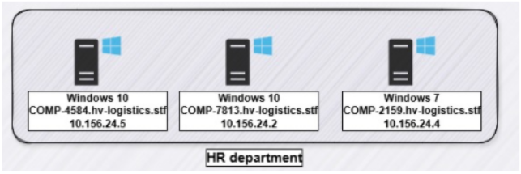

There are 2 domain controllers in the environment:

- `dc.hv-logistics.stf`
- `dc-2.hv-logistics.stf`


# Procedure

We know from the [previous task]() that the HR officer's workstation from which the attackers performed privilege escalation is `COMP-2159.hv-logistics.stf`.

## Checking on PT NAD.

- The first assumption was that the attackers downloaded the password file in cleartext from the HR officer's workstation.
- If this is the case, the network session triggered by this download should have been recorded by PT Network Attack Discovery (NAD).
- So PT NAD was checked during the timeframe of the attack.

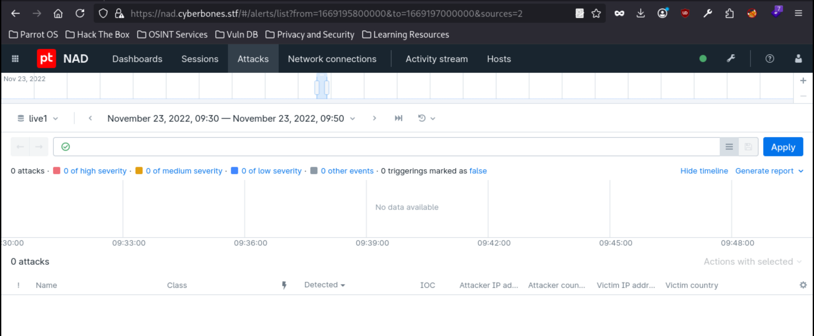

- Unfortunately PT-NAD shows no logged traffic during the timeframe of the attack

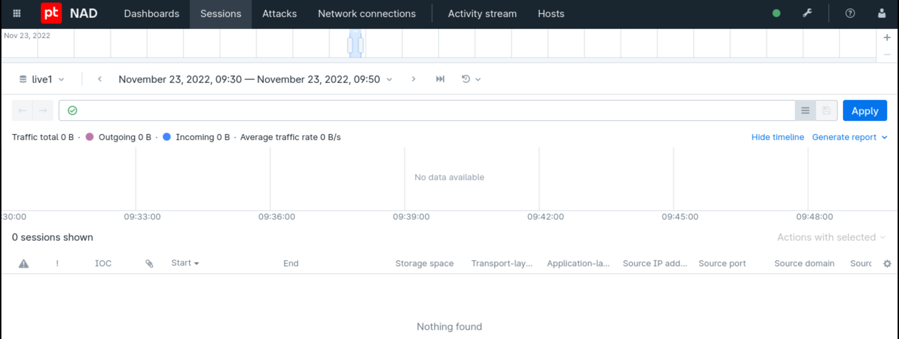


## Events at `dc-2.hv-logistics.stf`

```sql
event_src.host = "dc-2.hv-logistics.stf" and subject.account.name = "b_rivers_admin"
```

- The query above checks for all events whose source is the `dc-2.hv-logistics.stf` domain controller
and that the `subject.account.name` is `b_rivers_admin`.
- `subject.account.name` is the name of the account which is a subject that performs an action on an
object.
- The purpose of this query was to see if passwords are recorded at the domain controller during authentication events.
- There are 36 events returned by this query.

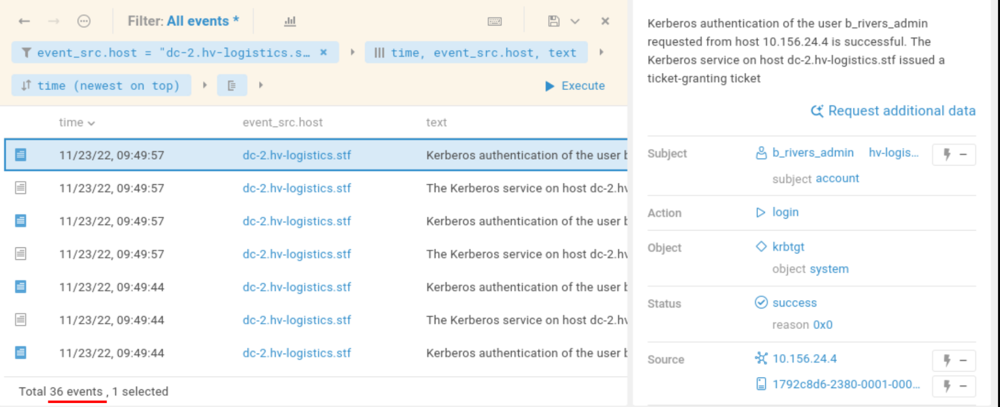

- They are primarily pairs of :
    - Successful authentication as `b_rivers_admin` to `dc-2.hv-logistics.stf` from the host `10.156.24.4` (which is the 
    HR Officer's computer), and leads to the delivery of a ticket-granting ticket.
    - Subsequent delivery of a Service ticket after getting the ticket-granting ticket in the previous step, to access the
    service `COMP-2159$`.

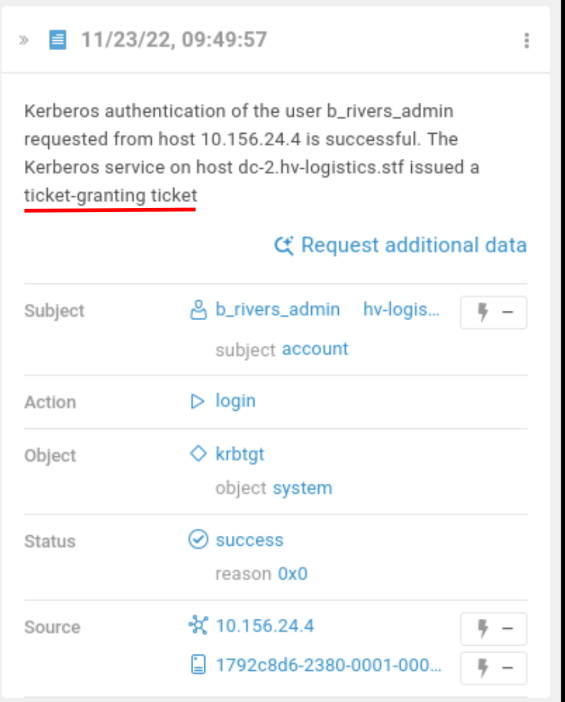

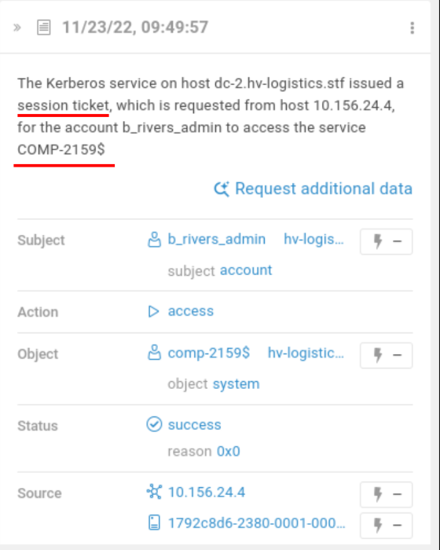


## Events at `COMP-2159.hv-logistics.stf` (10.156.24.4)

```sql
event_src.host = "COMP-2159.hv-logistics.stf"
```

- Out of the box, the query above gives 58,000 events.

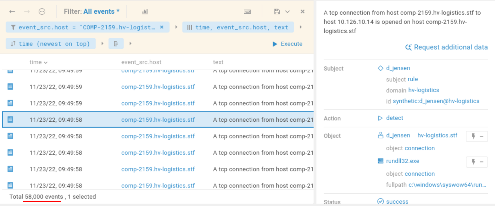


```sql
event_src.host = "COMP-2159.hv-logistics.stf" and subject.name = "b_rivers_admin"
```

- Filtering the command further to include events whose subject is `b_rivers_admin` on the host, reduced the events down
to 133.


- In the first few events of this list, we notice reports about the `d_jensen` user escalating privileges to the `b_rivers_admin`
account using the tool `runascs_net2.exe`

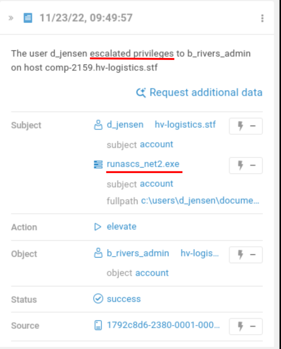

- `Runascs_net2.exe` is a tool that helps to run a specific process with different permissions other than the curent user's login.
It takes explicit password of the target account in its CLI.
- Thus if the user `d_jensen` used it to escalate to the `b_rivers_admin` account, there are high chances he might have used the
password of `b_rivers_admin` in that command.


```sql
event_src.host = "COMP-2159.hv-logistics.stf" and object.process.name = "runascs_net2.exe"
```

- The query above searches for instances where the binary `runascs_net2.exe` was used on the host `COMP-2159.hv-logistics.stf`.
- The aim is to find instances where its full cmdline was logged by the SIEM, so as to recover the password of `b_rivers_admin`.
- There are 54 events which match this filter.
- Among the matching instances, we find one instance where the attacker ran the help manual of the command.

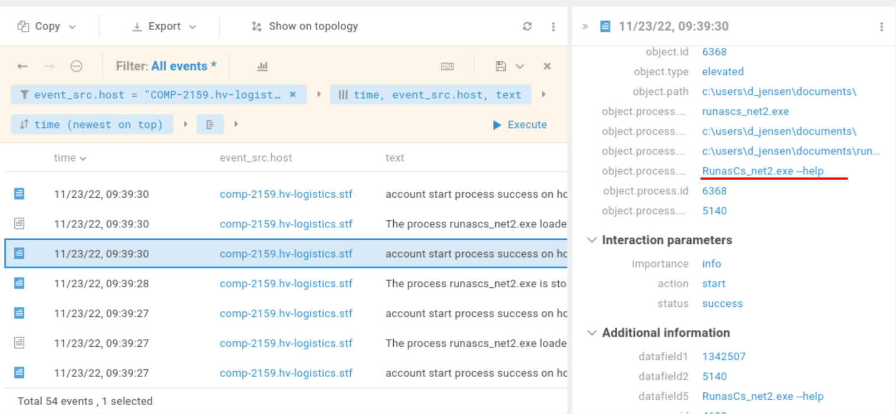

- Then we find an instance of a successful process start using `runascs_net2.exe` for the `b_rivers_admin` account.

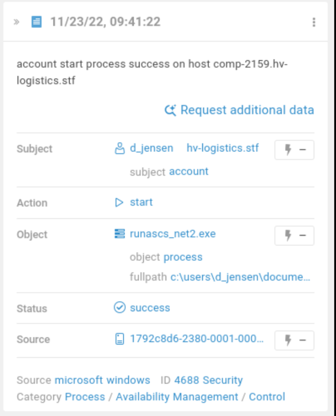

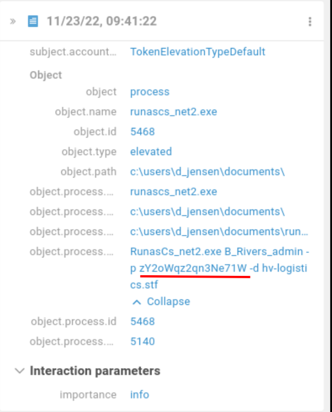


```
RunasCs_net2.exe  B_Rivers_admin -p zY2oWqz2qn3Ne71W -d hv-logistics.stf
```

- The password is `zY2oWqz2qn3Ne71W`


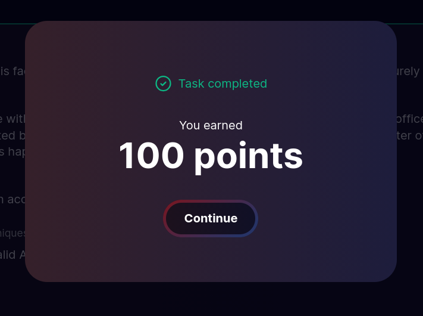


# Ref

- link to Task 7.1 blog post.